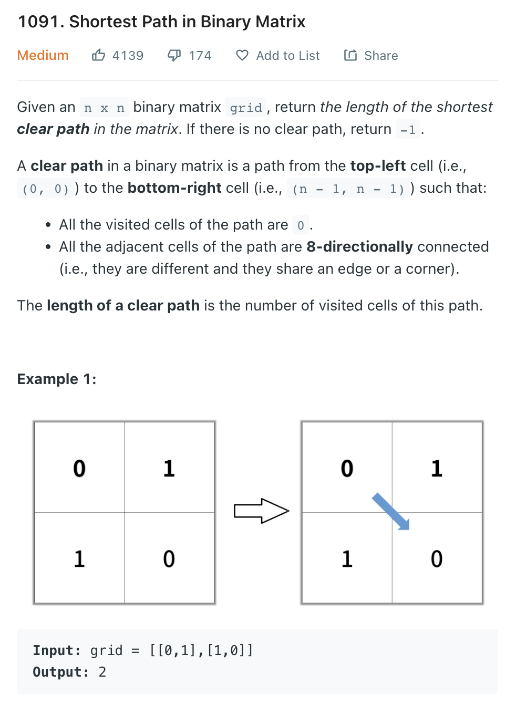

___
[1091. Shortest Path in Binary Matrix](https://leetcode.com/problems/shortest-path-in-binary-matrix/)
___


## 基本思路
* This is a classic BFS question.
* We do the level order traversal, add all avaliable coordinates and mark those coordinates visted.
* Since the distance between any valid adjacent coordinate is the same, so who ever first reach end of list will be the answer.
* In this question, we don't need extra space of visted, we can just modify the input grid

___

`Time complexity : O(n)`

`Space complexity : O(n)`
```python
class Solution:
    def shortestPathBinaryMatrix(self, grid: List[List[int]]) -> int:
        if grid[0][0] != 0:
            return -1
        
        n = len(grid)
        queue = collections.deque()
        queue.append((0, 0))
        grid[0][0] = 1
        level = 0
        
        while queue:
            level += 1
            for _ in range(len(queue)):
                i, j = queue.popleft()
                if i == n - 1 and j == n - 1:
                    return level

                for x, y in ((i-1,j-1),(i-1,j),(i-1,j+1),(i,j+1),(i+1,j+1),(i+1,j),(i+1,j-1),(i,j-1)):
                    if 0 <= x < n and 0 <= y < n and grid[x][y] == 0:
                        queue.append((x, y))
                        grid[x][y] = 1
        
        return -1
```