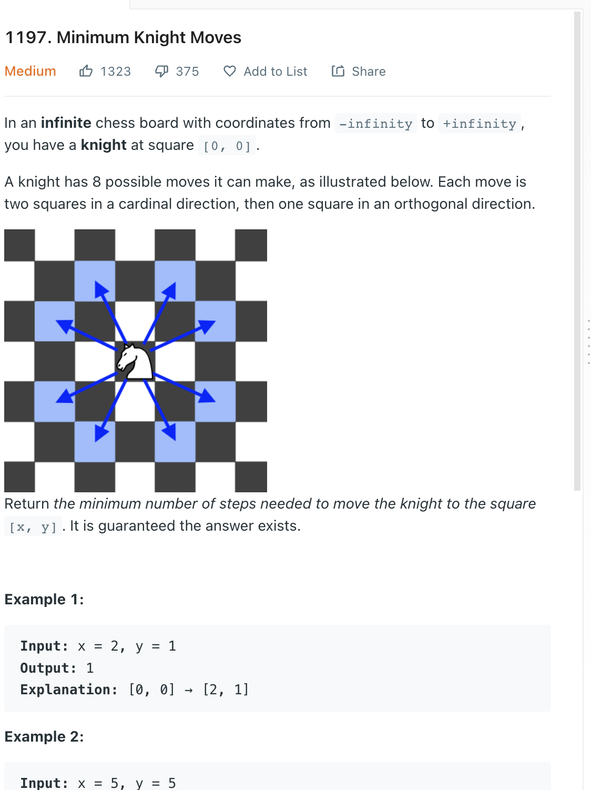

___
[1197. Minimum Knight Moves](https://leetcode.com/problems/minimum-knight-moves/)
___

## 分析问题
* It's ok to use a single BFS, but it will return TLE or MLE

## 基本思路
* Two way BFS is same as normal BFS.
* We expand the graph from both statring point and ending point
* We have 2 queues and 2 hashMaps
* Once we found there is a coordinate that is in both hashMaps, we can return the total steps.
* We don't need to care about the shortest distance, because we are using BFS and the weight of every edge is the same. So which one come first will be the answer

___

`Time complexity : O()`

`Space complexity : O()`
```python
class Solution:
    def minKnightMoves(self, targetX: int, targetY: int) -> int:
        
        levels = 0
        
        queue = collections.deque([(0, 0)])
        visited = set([(0, 0)])
        
        while queue:
             
            for _ in range(len(queue)):
                x, y = queue.popleft()
                if x == targetX and y == targetY:
                    return levels
                for row, col in [(x - 2, y - 1), (x - 1, y - 2), (x + 1, y - 2), (x + 2, y - 1), (x + 2, y + 1), (x + 1, y + 2), (x - 1, y + 2), (x - 2, y + 1)]:
                    if (row, col) not in visited:
                        visited.add((row, col))
                        queue.append((row, col))     
            levels += 1
        return -1
```

___

```python
class Solution:
    def minKnightMoves(self, x: int, y: int) -> int:
        # the offsets in the eight directions
        offsets = [(1, 2), (2, 1), (2, -1), (1, -2),
                   (-1, -2), (-2, -1), (-2, 1), (-1, 2)]

        # data structures needed to move from the origin point
        origin_queue = deque([(0, 0)])
        origin_distance = {(0, 0): 0}

        # data structures needed to move from the target point
        target_queue = deque([(x, y)])
        target_distance = {(x, y): 0}

        while True:
            
            # check if we reach the circle of target
            origin_x, origin_y = origin_queue.popleft()
            origin_steps = origin_distance[(origin_x, origin_y)]
            if (origin_x, origin_y) in target_distance:
                return origin_steps + target_distance[(origin_x, origin_y)]

            # check if we reach the circle of origin
            target_x, target_y = target_queue.popleft()
            target_steps = target_distance[(target_x, target_y)]
            if (target_x, target_y) in origin_distance:
                return target_steps + origin_distance[(target_x, target_y)]

            for offset_x, offset_y in offsets:
                # expand the circle of origin
                next_origin_x, next_origin_y = origin_x + offset_x, origin_y + offset_y
                if (next_origin_x, next_origin_y) not in origin_distance:
                    origin_queue.append((next_origin_x, next_origin_y))
                    origin_distance[(next_origin_x, next_origin_y)] = origin_steps + 1

                # expand the circle of target
                next_target_x, next_target_y = target_x + offset_x, target_y + offset_y
                if (next_target_x, next_target_y) not in target_distance:
                    target_queue.append((next_target_x, next_target_y))
                    target_distance[(next_target_x, next_target_y)] = target_steps + 1
```