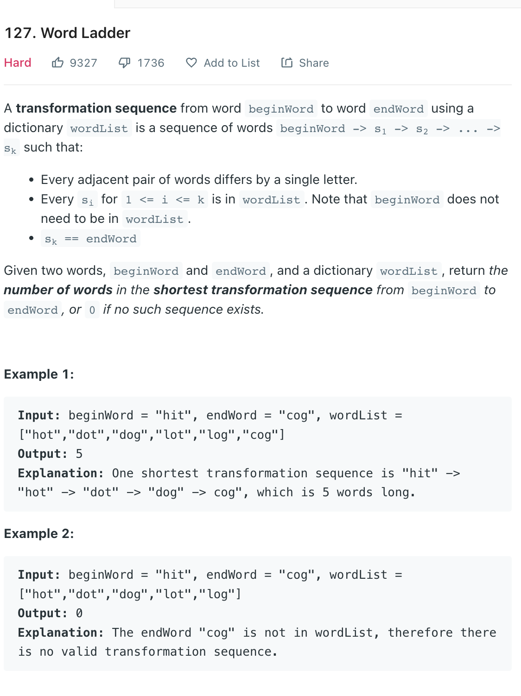

___
[127. Word Ladder](https://leetcode.com/problems/word-ladder/)
___

## 分析问题
* It seems like a string question, but actrully we can convert this into a graph question

## 基本思路
* Modify one char of current_word, if current_word is in the `dic`, mark as visited and add into `queue` 

* If we do the level order traversal, the answer will be shortest.
___

M is the length of `queue`
N is the length of `wordList`
`Time complexity : O(M^2 * N))`

`Space complexity : O(N)`
```python
    def ladderLength(self, beginWord: str, endWord: str, wordList: List[str]) -> int:
        dic = set(wordList)
        
        if endWord not in dic:
            return 0
        
        
        queue = collections.deque([beginWord])
        visited = set(beginWord)
        answer = 0
        
        while queue:
            answer += 1
            for i in range(len(queue)):
                beginWord = queue.popleft()
                for i in range(len(beginWord)):
                    temp_word = list(beginWord)
                    for c in range(ord('a'), ord('z') + 1):
                        if temp_word[i] == chr(c):
                            continue
                        temp_word[i] = chr(c)
                        temp_str_word = "".join(temp_word)
                        
                        if temp_str_word in visited:
                            continue
                        if temp_str_word == endWord:
                            return answer + 1
                        
                        if temp_str_word in dic:
                            visited.add(temp_str_word)
                            queue.append(temp_str_word)
                        
        return 0
```

___

```python
class Solution:
    def ladderLength(self, beginWord: str, endWord: str, wordList: List[str]) -> int:
        wordList = set(wordList)
        if endWord not in wordList:
            return 0
        
        queue = collections.deque()
        visited = set()
        queue.append(beginWord)
        visited.add(beginWord)
        levels = 0
        
        while queue:
            levels += 1
            for _ in range(len(queue)):
                beginWord = queue.popleft()
                if beginWord == endWord:
                    return levels
                
                beginWord = list(beginWord)
                for i in range(len(beginWord)):
                    originalChar = beginWord[i]
                    for replaceChar in range(ord('a'), ord('z') + 1):
                        if replaceChar == originalChar:
                            continue
                        beginWord[i] = chr(replaceChar)
                        tempWord = ''.join(beginWord)
                        if tempWord not in visited and tempWord in wordList:
                            queue.append(tempWord)
                            visited.add(tempWord)
                    beginWord[i] = originalChar
                            
        return 0
```