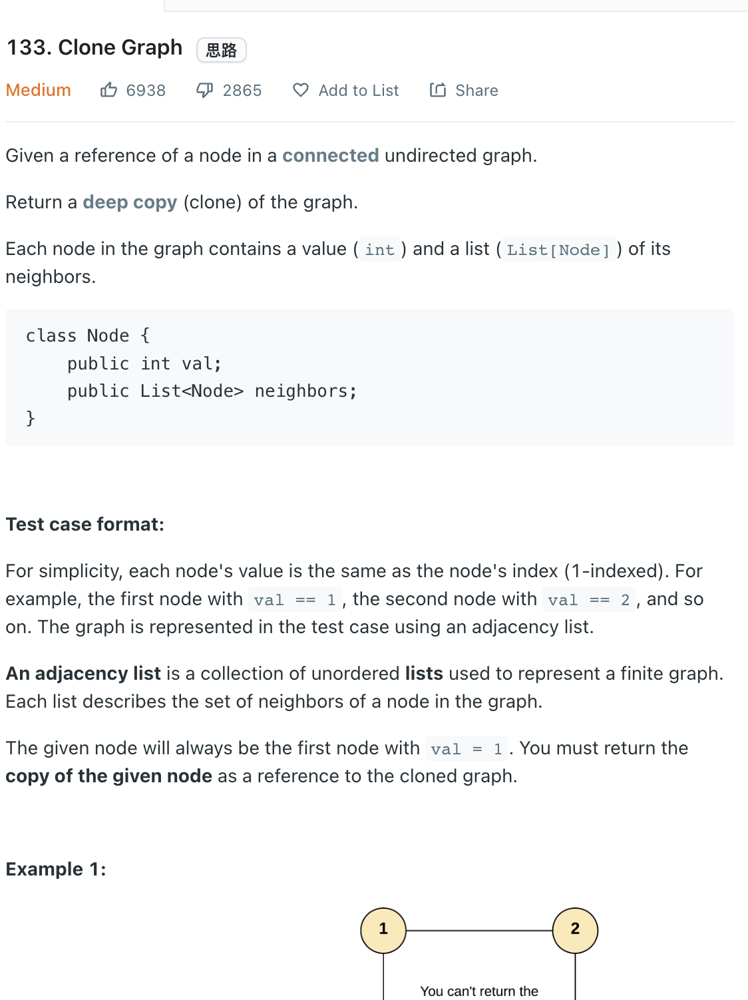

___
[133. Clone Graph](https://leetcode.com/problems/clone-graph/)
___

## 分析问题
* This is a classic BFS question
* This graph is undirected, so make sure add the edge properly

## 基本思路
* Having a `queue` that can perform the BST
* Having a `dic` that can check visited and store the information of node
* Do the level order traversal, create the node, append into the `neighbor` and append into `dic`

___

N == num of Node
M == num of edge
`Time complexity : O(N + M)`

`Space complexity : O(N)`
```python
    def cloneGraph(self, node: 'Node') -> 'Node':
        if not node:
            return None
        queue = collections.deque([node])
        dic = {node: Node(node.val)}
        
        while queue:
            currentNode = queue.popleft()
            for neighbro in currentNode.neighbors:
                if neighbro not in dic:
                    dic[neighbro] = Node(neighbro.val)
                    queue.append(neighbro)
                dic[currentNode].neighbors.append(dic[neighbro])
        
        return dic[node]
```