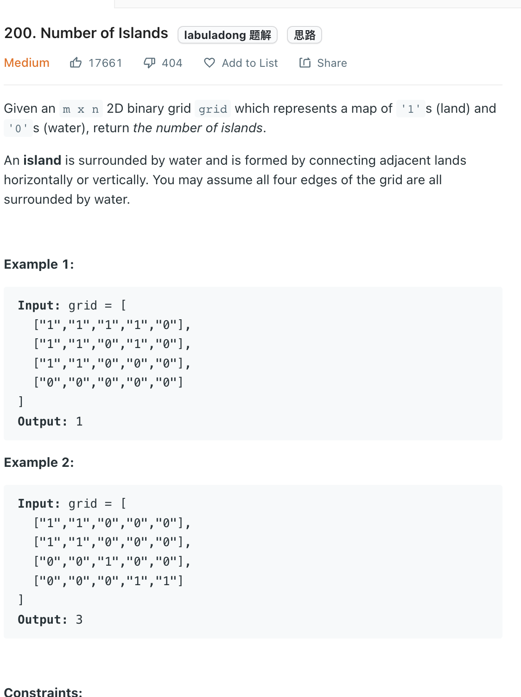

___
[200. Number of Islands](https://leetcode.com/problems/number-of-islands/)
___

## 分析问题
* We can use DFS or BFS.

## 基本思路
* If we find a potential island (`grid[i][j]` == '1'),
* We will extend this island(check horizontally and vertically) and mark it as visited (`grid[i][j]` == '0') and also add this coordinate into `queue` to continue previous process until there are no near by island

___

M == len(grid)
N == len(grid[0])
`Time complexity : O(M * N)`

`Space complexity : O(min(M, N))`
```python
    def numIslands(self, grid: List[List[str]]) -> int:
        answer = 0
        directions = [[1, 0], [-1, 0], [0, -1], [0, 1]]
        m = len(grid)
        n = len(grid[0])
        print(m, n)
        
        def bfs(row, col):
            nonlocal m
            nonlocal n
            
            queue = collections.deque()
            queue.append([row, col])
            
            while queue:
                row, col = queue.popleft()
                
                for direction in directions:
                    new_row = row + direction[0]
                    new_col = col + direction[1]
                    if new_row >= 0 and new_row < m and new_col >= 0 and new_col < n and grid[new_row][new_col] != '0':
                        grid[new_row][new_col] = '0'
                        queue.append([new_row, new_col])

        
        for i in range(m):
            for j in range(n):
                if grid[i][j] == '1':
                    bfs(i, j)
                    answer += 1
        
        return answer
```