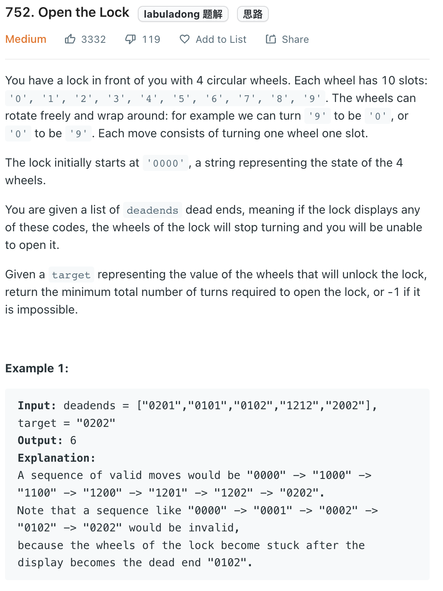

___
[752. Open the Lock](https://leetcode.com/problems/open-the-lock/)
___


## 基本思路
* Each time, we try turnUp or turnDown
* For example
* The starting is `0000`
* Next step, we have 
* `9000`, `1000`, `0900`, `0100`...

___

`Time complexity : O()`

`Space complexity : O()`
```python
class Solution:
    def openLock(self, deadends: List[str], target: str) -> int:
    
        def turnUp(current, i):
            if current[i] == '9':
                current[i] = '0'
            else:
                current[i] = chr(ord(current[i]) + 1)
            return ''.join(current)
        def turnDown(current, i):
            if current[i] == '0':
                current[i] = '9'
            else:
                current[i] = chr(ord(current[i]) - 1)
            return ''.join(current)
            
        deadends = set(deadends)
        
        queue = collections.deque()
        queue.append('0000')
        visited = set()
        visited.add('0000')
        
        steps = 0
        while queue:
            for _ in range(len(queue)):
                current = queue.popleft()
                
                if current in deadends:
                    continue
                if current == target:
                    return steps
                for i in range(4):
                    currentUp = turnUp(list(current), i)
                    if currentUp not in visited:
                        visited.add(currentUp)
                        queue.append(currentUp)
                    currentDown = turnDown(list(current), i)
                    if currentDown not in visited:
                        visited.add(currentDown)
                        queue.append(currentDown)
            steps += 1
    
        return -1
```