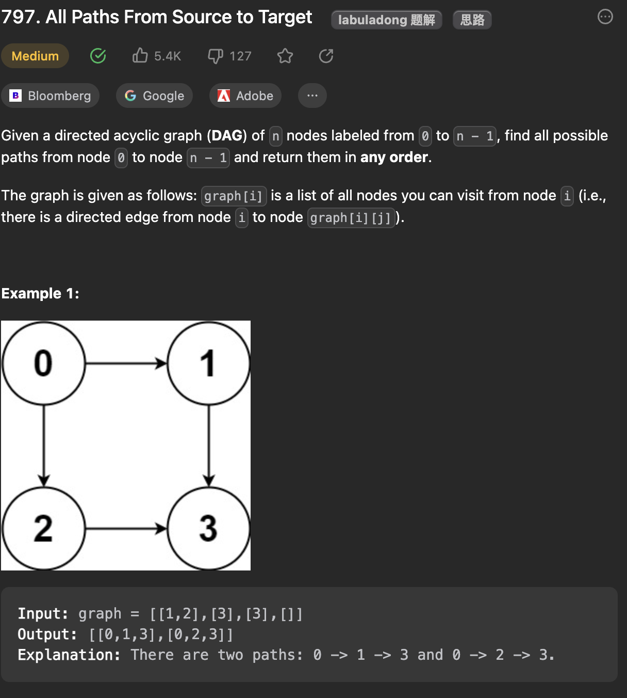

___
[797. All Paths From Source to Target](https://leetcode.com/problems/all-paths-from-source-to-target/description/)
___

## 基本思路
* This is a normal BFS question, we can also use DFS(Coding will be short).

___

`Time complexity : O(n)`

`Space complexity : O(n)`
```python
class Solution:
    def allPathsSourceTarget(self, graph: List[List[int]]) -> List[List[int]]:
        dic = defaultdict(list)
        target = len(graph) - 1
        for fromNode, toNodes in enumerate(graph):
            for toNode in toNodes:
                dic[fromNode].append(toNode)

        queue = [(0, [0])]
        answer = []
        while queue:
            fromNode, currentPath = queue.pop()
            for toNode in dic[fromNode]:
                newCurrentPath = currentPath.copy()
                newCurrentPath.append(toNode)
                temp = (toNode, newCurrentPath)
                if toNode == target:
                    answer.append(newCurrentPath)
                queue.append(temp)

        return answer
```