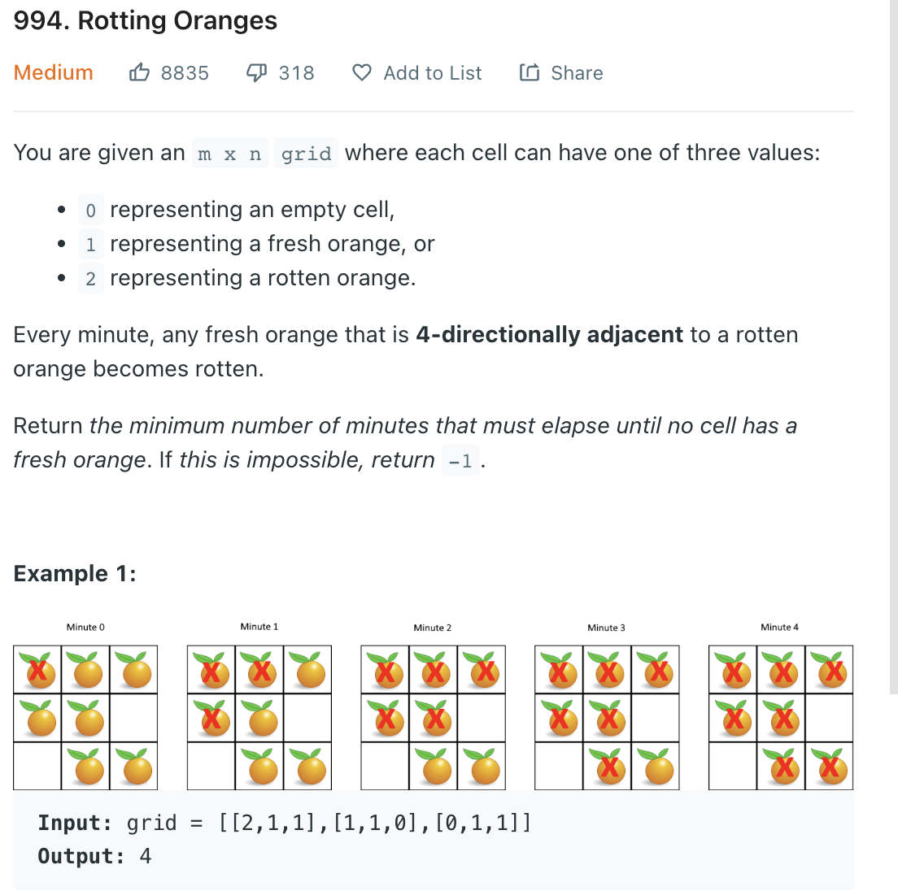

___
[994. Rotting Oranges](https://leetcode.com/problems/rotting-oranges/)
___


## 基本思路
* This is a classic BFS question
* Find total number of fresh orange
* Find the position of all rotten orange
* Then starting BFS with all rotten orange

___

`Time complexity : O(M * N)`

`Space complexity : O(M * N)`
```python
class Solution:
    def orangesRotting(self, grid: List[List[int]]) -> int:
        num_of_fresh = 0
        row_length = len(grid)
        col_length = len(grid[0])
        steps = -1
        q = collections.deque()
        for i in range(row_length):
            for j in range(col_length):
                if grid[i][j] == 1:
                    num_of_fresh += 1
                if grid[i][j] == 2:
                    q.append((i, j))
        if num_of_fresh == 0:
            return 0
        
        while q:
            steps += 1
            for _ in range(len(q)):
                row, col = q.popleft()
                for (x, y) in [[1, 0], [-1, 0], [0, -1], [0, 1]]:
                    new_row = row + x
                    new_col = col + y
                    if 0 <= new_row < row_length and 0 <= new_col < col_length:
                        if grid[new_row][new_col] == 1:
                            q.append((new_row, new_col))
                            num_of_fresh -= 1
                            grid[new_row][new_col] = 2
        return steps if num_of_fresh == 0 else -1
                                 
        
```