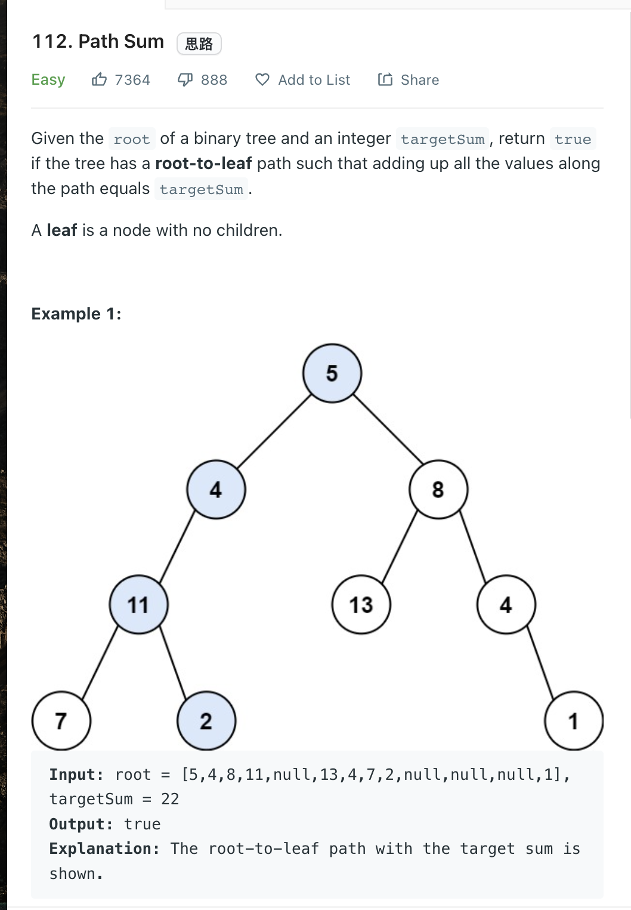

___
[112. Path Sum](https://leetcode.com/problems/path-sum/)
___

## 分析问题
* Classic DFS

## 基本思路
* 

___

`Time complexity : O(N)`

`Space complexity : O(1)`
```python
    def hasPathSum(self, root: Optional[TreeNode], targetSum: int) -> bool:
        if not root:
            return False
        
        if not root.left and not root.right and targetSum == root.val:
            return True
        
        return self.hasPathSum(root.left, targetSum - root.val) or self.hasPathSum(root.right, targetSum - root.val)
```