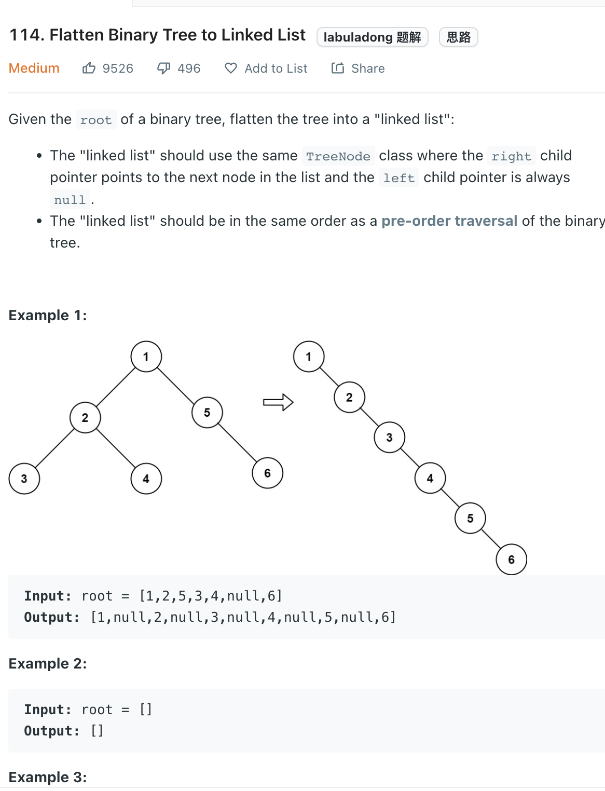

___
[114. Flatten Binary Tree to Linked List](https://leetcode.com/problems/flatten-binary-tree-to-linked-list/)
___

## 基本思路
* The key point is how to return the right most leaf node of every sub-tree
* Within a post-order traversal, we know the `right` is always the right most leaf node
* And then reconntect the edge
```
left.right = root.right
root.right = root.left
root.left = None
```

___

`Time complexity : O(n)`

`Space complexity : O(1)`
```python
    def flatten(self, root: Optional[TreeNode]) -> None:
        self.dfs(root)
        
    def dfs(self, root):
        if not root:
            return None
        
        if not root.left and not root.right:
            return root
        
        left = self.dfs(root.left)
        right = self.dfs(root.right)
        
        if left:
            left.right = root.right
            root.right = root.left
            root.left = None
        return right if right else left
```