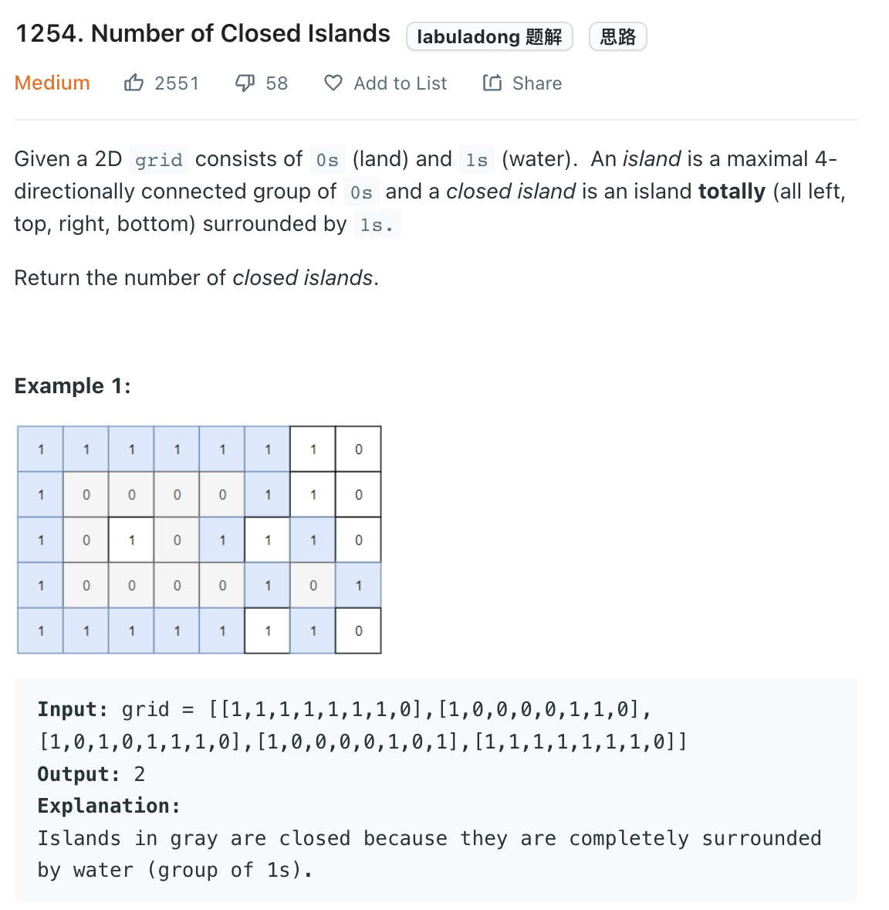

___
[1254. Number of Closed Islands](https://leetcode.com/problems/number-of-closed-islands/)
___


## 基本思路
* 0 is land, 1 is water.
* If we see land at edge and expand it. We will able to mark a unqualify closed land.
* Then, rest of land in the grid will must be valid

___

`Time complexity : O()`

`Space complexity : O()`
```python
class Solution:
    def closedIsland(self, grid: List[List[int]]) -> int:
        
        
        def dfs(grid, row, col):
            if 0 <= row < len(grid) and 0 <= col < len(grid[0]) and grid[row][col] == 0:
                grid[row][col] = 1
                dfs(grid, row - 1, col)
                dfs(grid, row + 1, col)
                dfs(grid, row, col - 1)
                dfs(grid, row, col + 1)
        
        for i in range(len(grid[0])):
            dfs(grid, 0, i)
            dfs(grid, len(grid) - 1, i)
            
        for i in range(len(grid)):
            dfs(grid, i, 0)
            dfs(grid, i, len(grid[0]) - 1)
            
        answer = 0
        
        for i in range(len(grid)):
            for j in range(len(grid[0])):
                if grid[i][j] == 0:
                    answer += 1
                    dfs(grid, i, j)
        
        return answer
```