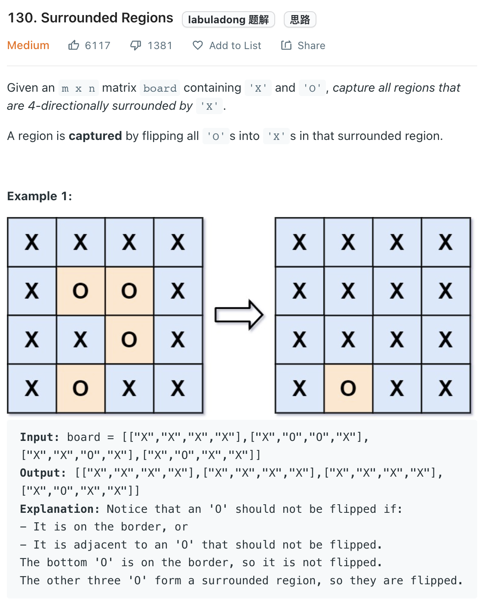

___
[130. Surrounded Regions](https://leetcode.com/problems/surrounded-regions/)
___


## 基本思路
* This is same as [1254. Number of Closed Islands](https://github.com/longlonglu/shuati/blob/main/DFS/1254.%20Number%20of%20Closed%20Islands/1254.%20Number%20of%20Closed%20Islands.md)

___

`Time complexity : O()`

`Space complexity : O()`
```python
class Solution:
    def solve(self, board: List[List[str]]) -> None:
        """
        Do not return anything, modify board in-place instead.
        """
        
        def dfs(row, col, val):
            if 0 <= row < len(board) and 0 <= col < len(board[0]) and board[row][col] == 'O':
                board[row][col] = val
                dfs(row + 1, col, val)
                dfs(row - 1, col, val)
                dfs(row, col + 1, val)
                dfs(row, col - 1, val)
                
        for i in range(len(board)):
            dfs(i, 0, '1')
            dfs(i, len(board[0]) - 1, '1')
            
        for i in range(len(board[0])):
            dfs(0, i, '1')
            dfs(len(board) - 1, i, '1')
        
        for i in range(len(board)):
            for j in range(len(board[0])):
                if board[i][j] == 'O':
                    dfs(i, j, '2')
        
        for i in range(len(board)):
            for j in range(len(board[0])):
                if board[i][j] == '1':
                    board[i][j] = 'O'
                if board[i][j] == '2':
                    board[i][j] = 'X'
```