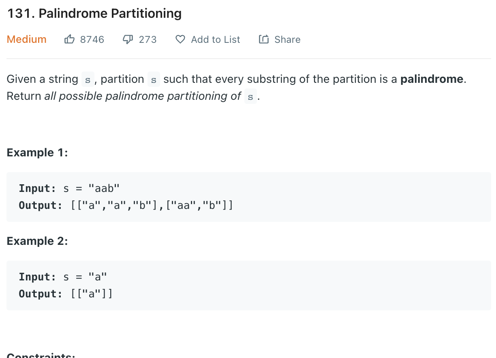

___
[131. Palindrome Partitioning](https://leetcode.com/problems/palindrome-partitioning/)
___


## 基本思路
* The starting index is also really import while backtracking.

___

`Time complexity : O()`

`Space complexity : O()`
```python
class Solution:
    def partition(self, s: str) -> List[List[str]]:
        answer = []
        path = []
        
        def isPalindrome(word):
            for i in range(len(word) // 2):
                if word[i] != word[len(word) - i - 1]:
                    return False
            return True
        
        def backtracking(index):
            if index >= len(s):
                answer.append(list(path))
            
            for i in range(index, len(s)):
                if isPalindrome(s[index:i + 1]):
                    path.append(s[index:i + 1])
                    backtracking(i + 1)
                    path.pop()
                    
        backtracking(0)
        return answer
```