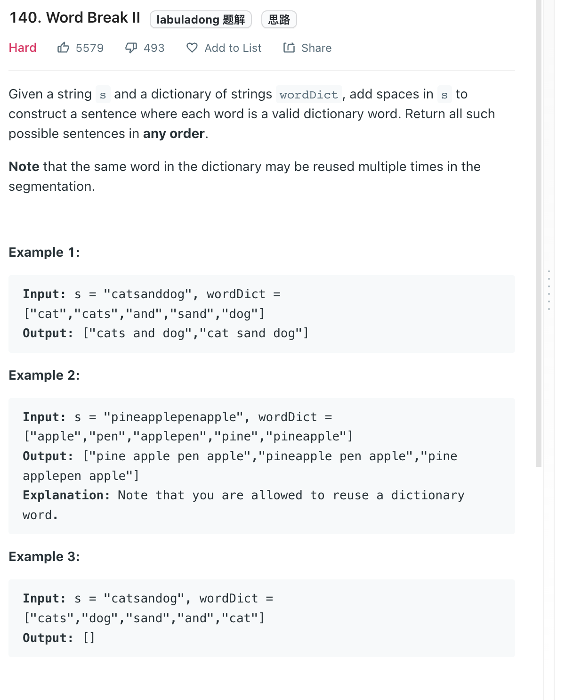

___
[140. Word Break II](https://leetcode.com/problems/word-break-ii/)
___


## 基本思路
* 标准的DFS

___

`Time complexity : O()`

`Space complexity : O()`
```java
class Solution {

    List<String> res = new LinkedList<>();
    
    public List<String> wordBreak(String s, List<String> wordDict) {
        wordBreakMemo(s, new HashSet<>(wordDict), 0, new ArrayList<String>());
        return res;
    }

    private void wordBreakMemo(String s, Set<String> wordDict, int start, ArrayList<String> currentPath) {
        if (start == s.length()) {
            String singleAnswer = "";
            for (String temp: currentPath) {
                singleAnswer = singleAnswer + " " + temp;
            }
            res.add(singleAnswer.substring(1, singleAnswer.length()));
        }
        for (int end = start + 1; end <= s.length(); end++) {
            String word = s.substring(start, end);
            if (wordDict.contains(word)) {
                currentPath.add(word);
                wordBreakMemo(s, wordDict, end, currentPath);
                currentPath.remove(currentPath.size() - 1);
            }
        }
    }
}

```