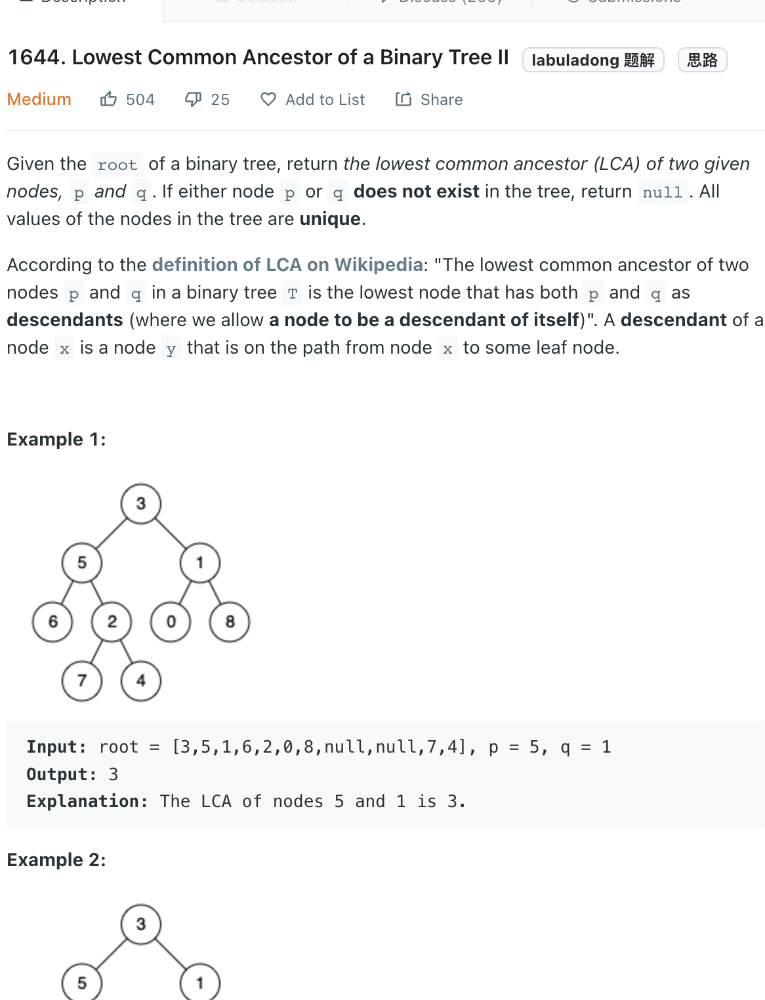

___
[1644. Lowest Common Ancestor of a Binary Tree II](https://leetcode.com/problems/lowest-common-ancestor-of-a-binary-tree-ii/)
___

## 分析问题
* 

## 基本思路
* It's almost the same at [236. Lowest Common Ancestor of a Binary Tree](https://github.com/longlonglu/shuati/blob/main/DFS/236.%20Lowest%20Common%20Ancestor%20of%20a%20Binary%20Tree/236.%20Lowest%20Common%20Ancestor%20of%20a%20Binary%20Tree.md)

___

`Time complexity : O(n)`

`Space complexity : O(1)`
```java

class Solution {
    
    boolean foundP = false;
    boolean foundQ = false;
    public TreeNode lowestCommonAncestor(TreeNode root, TreeNode p, TreeNode q) {
        TreeNode node = dfs(root, p, q);
        return foundP && foundQ ? node : null;
    }
    
    public TreeNode dfs(TreeNode root, TreeNode p, TreeNode q) {
        if (root == null) { return null; }
        
        TreeNode left = dfs(root.left, p, q);
        TreeNode right = dfs(root.right, p, q);
        
        if (root == p) {
            foundP = true;
            return root;
        }
        if (root == q) {
            foundQ = true;
            return root;
        }
        
        if (left != null && right != null) {
            return root;
        }
        return left == null ? right : left;
    }
}
```