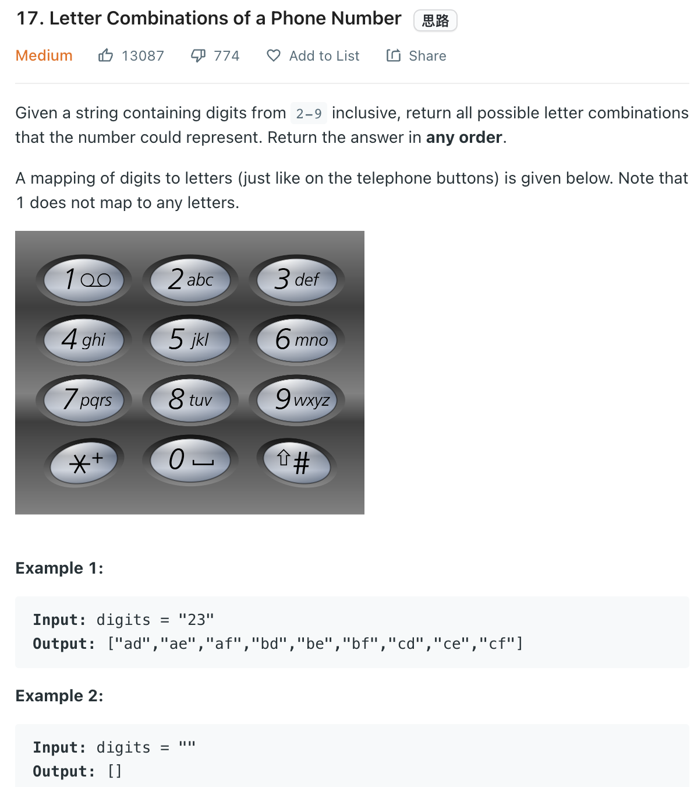

___
[17. Letter Combinations of a Phone Number](https://leetcode.com/problems/letter-combinations-of-a-phone-number/)
___


## 基本思路
* 

___

`Time complexity : O(4^N * N)`

`Space complexity : O(N)`
```java
class Solution {
    public List<String> letterCombinations(String digits) {
        List<String> answer = new ArrayList<>();
        if (digits == null || digits.length() == 0) { return answer; }
        String[] s = new String[digits.length()];
        int i = 0;
        for (char c: digits.toCharArray()) { s[i++] = map(c); }
        DFS(answer, "", 0, digits.length(), s);
        
        return answer;
    }
    
    public void DFS(List<String> answer, String current, int index, int length, String[] s) {
        if (current.length() == length) { answer.add(current); return; }
        for (int i = index; i < length; i++) {
            String temp = s[i];
            for (int j = 0; j < temp.length(); j++) {
                current += temp.charAt(j);
                DFS(answer, current, i + 1, length, s);
                current = current.substring(0, current.length() - 1);
            }
        }
        
    }
    
    public String map(char c) {
        switch(c) {
                case '2':
                    return "abc";
                
                case '3':
                    return "def";
                
                case '4':
                    return "ghi";
                
                case '5':
                    return "jkl";
                
                case '6':
                    return "mno";
                
                case '7':
                    return "pqrs";
                
                case '8':
                    return "tuv";
                
                case '9':
                    return "wxyz";
                
            default:
                return null;
        }
    }
}
```