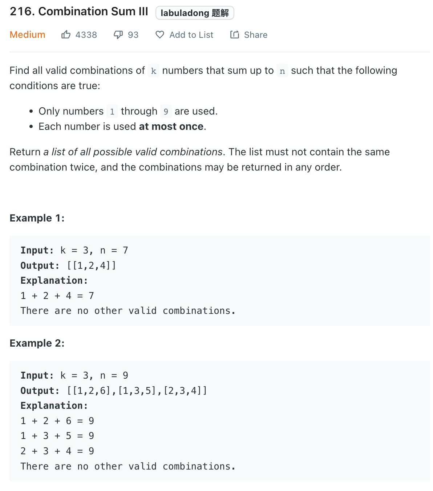

___
[216. Combination Sum III](https://leetcode.com/problems/combination-sum-iii/)
___


## 基本思路
* 

___

`Time complexity : O()`

`Space complexity : O(K)`
```python
    def combinationSum3(self, k: int, n: int) -> List[List[int]]:
        
        
        def dfs(current_list, current_sum, index):
            if len(current_list) > k:
                return
            
            if len(current_list) == k and current_sum == n:
                answer.append(list(current_list))
                
            for i in range(index, 10):
                if current_sum + i > n:
                    return
                current_list.append(i)
                dfs(current_list, current_sum + i, i + 1)
                del current_list[-1]
        
        answer = []
        dfs([], 0, 1)
        
        return answer
```