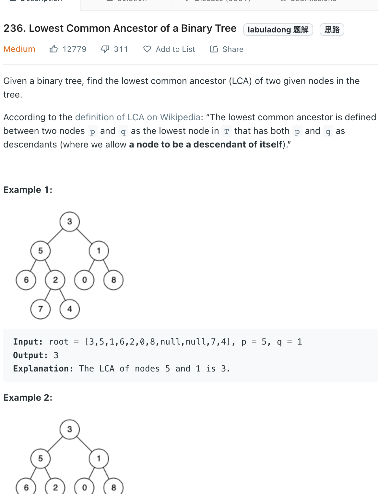

___
[236. Lowest Common Ancestor of a Binary Tree](https://leetcode.com/problems/lowest-common-ancestor-of-a-binary-tree/)
___

## 基本思路
* There are 3 situations
* 1. The ancestor is the root, `p` is root.left or right and `q` is root.left or right
* 2. `p` is the ancestor
* 3. `q` is the ancestor
* Do a `DFS`, if we found `p` or `q` just return it.
* Base on above 3 situations, we can easily find the answer

___

`Time complexity : O(n)`

`Space complexity : O(1)`
```python
    def lowestCommonAncestor(self, root: 'TreeNode', p: 'TreeNode', q: 'TreeNode') -> 'TreeNode':
        if not root:
            return None
        
        if root in [p, q]:
            return root
        
        left = self.lowestCommonAncestor(root.left, p, q)
        right = self.lowestCommonAncestor(root.right, p, q)
        
        if left and right:
            return root
        
        return left or right
```