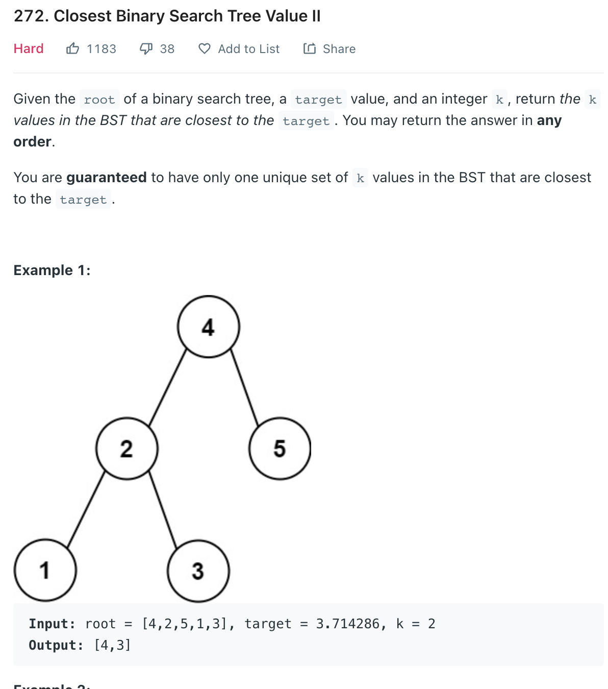

___
[272. Closest Binary Search Tree Value II](https://leetcode.com/problems/closest-binary-search-tree-value-ii/)
___

## 基本思路
* Eventhough this is a hard question, but turns out pretty easy to solve.
* Inorder traverse the BST and push the value into a `min heap` with size of `k`

___

`Time complexity : O(n)`

`Space complexity : O(k)`
```python
from heapq import heappush, heappop
class Solution:
    def closestKValues(self, root: Optional[TreeNode], target: float, k: int) -> List[int]:
        heap = []
        
        def dfs(root):
            if not root:
                return 
            
            dfs(root.left)
            heappush(heap, (-abs(root.val - target), root.val))
            if len(heap) > k:
                heappop(heap)
            dfs(root.right)
            
        dfs(root)
        return [x for _, x in heap]
```