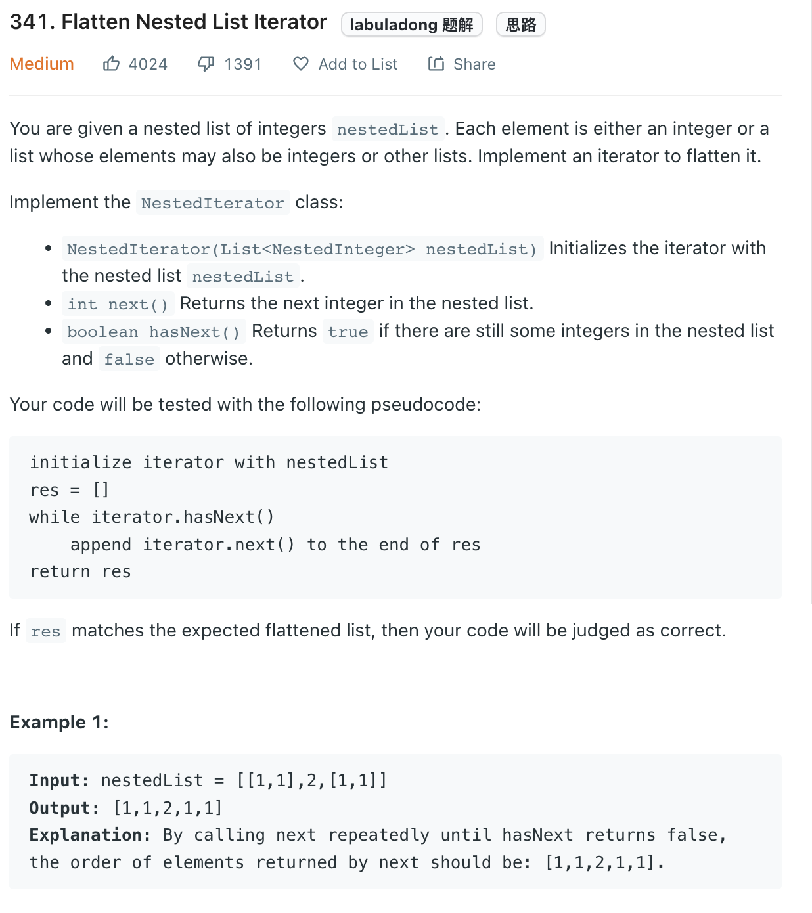

___
[341. Flatten Nested List Iterator](https://leetcode.com/problems/flatten-nested-list-iterator/)
___

## 分析问题
* 

## 基本思路
* 

___

`Time complexity : O()`

`Space complexity : O()`
```python
# """
# This is the interface that allows for creating nested lists.
# You should not implement it, or speculate about its implementation
# """
#class NestedInteger:
#    def isInteger(self) -> bool:
#        """
#        @return True if this NestedInteger holds a single integer, rather than a nested list.
#        """
#
#    def getInteger(self) -> int:
#        """
#        @return the single integer that this NestedInteger holds, if it holds a single integer
#        Return None if this NestedInteger holds a nested list
#        """
#
#    def getList(self) -> [NestedInteger]:
#        """
#        @return the nested list that this NestedInteger holds, if it holds a nested list
#        Return None if this NestedInteger holds a single integer
#        """

class NestedIterator:
    
    def __init__(self, nestedList: [NestedInteger]):
        def flatten_list(nested_list):
            for nested_integer in nested_list:
                if nested_integer.isInteger():
                    self._integers.append(nested_integer.getInteger())
                else:
                    flatten_list(nested_integer.getList()) 
        self._integers = []
        self._position = -1 # Pointer to previous returned.
        flatten_list(nestedList)
    
    def next(self) -> int:
        self._position += 1
        return self._integers[self._position]
        
    def hasNext(self) -> bool:
        return self._position + 1 < len(self._integers)
         

# Your NestedIterator object will be instantiated and called as such:
# i, v = NestedIterator(nestedList), []
# while i.hasNext(): v.append(i.next())
```