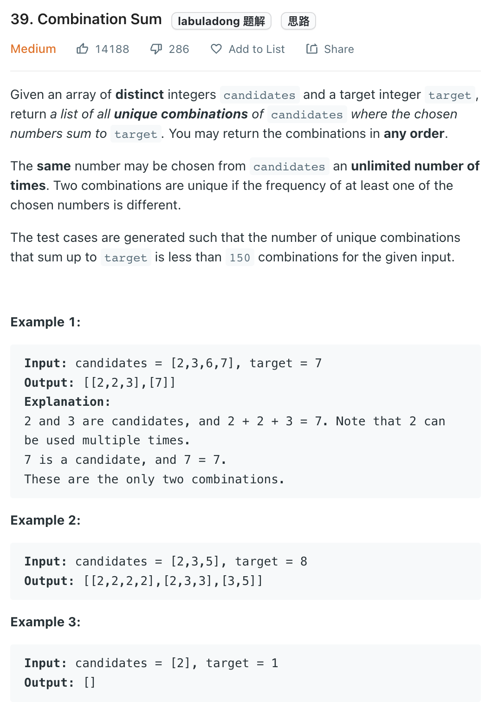

___
[39. Combination Sum](https://leetcode.com/problems/combination-sum/)
___

## 分析问题
* 

## 基本思路
* 

___

`Time complexity : O()`

`Space complexity : O()`
```python
class Solution:
    def combinationSum(self, candidates: List[int], target: int) -> List[List[int]]:
        candidates.sort()
        answer = []
        
        def dfs(currentList, currentSum, index):
            if currentSum > target:
                return
            if currentSum == target:
                answer.append(list(currentList))
                
            for i in range(index, len(candidates)):
                if currentSum + candidates[i] > target:
                    break
                currentList.append(candidates[i])
                dfs(currentList, currentSum + candidates[i], i)
                currentList.pop()
                
        dfs([], 0, 0)
        return answer
```