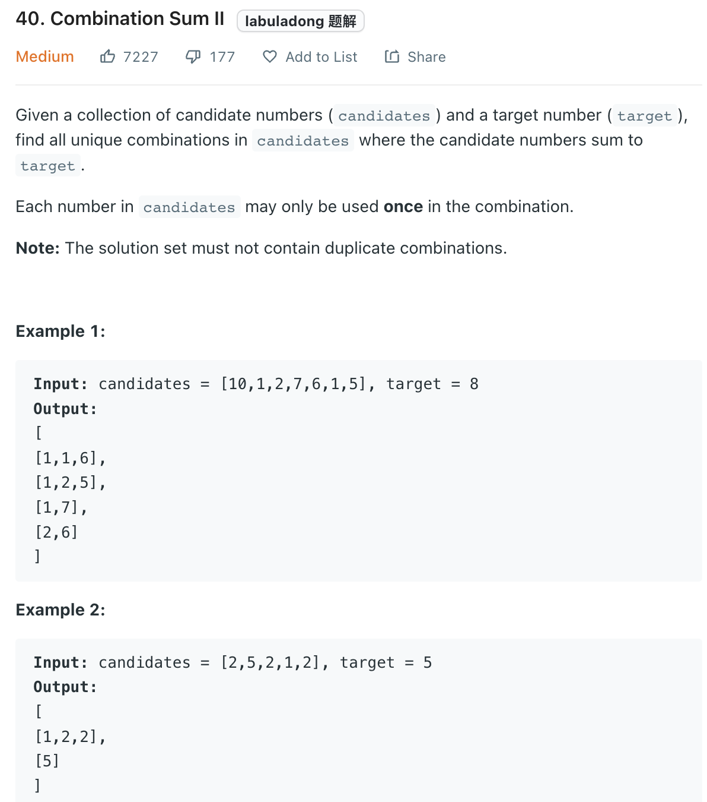

___
[40. Combination Sum II](https://leetcode.com/problems/combination-sum-ii/)
___


## 基本思路
* The hard point is to avoid duplicate combinations.
* If we sort the `candidates`, then same element will be next to each other
```python
if i != index and candidates[i] == candidates[i - 1]:
    continue
```
* if `[1, 1, 2, 5, 6, 7, 10]` current picking index `i` is not equals to our staring index `index` 
* and  `candidates[i] == candidates[i - 1]` which we know this combination might be duplicate
* Think of `[1, 2, 5]` and `[1, 2, 5]`

___

`Time complexity : O(?)`

`Space complexity : O(len(candidates))`
```python
    def combinationSum2(self, candidates: List[int], target: int) -> List[List[int]]:
        
        candidates.sort()
        
        def dfs(current_list, current_sum, index):
            if current_sum == target:
                answer.append(list(current_list))
                return
            
            for i in range(index, len(candidates)):
                if i > index and candidates[i] == candidates[i - 1]:
                    continue
                if current_sum + candidates[i] > target:
                    return
                current_list.append(candidates[i])
                dfs(current_list, current_sum + candidates[i], i + 1)
                current_list.pop()
            
        answer = []
        
        dfs([], 0, 0)
        
        return list(answer)
```