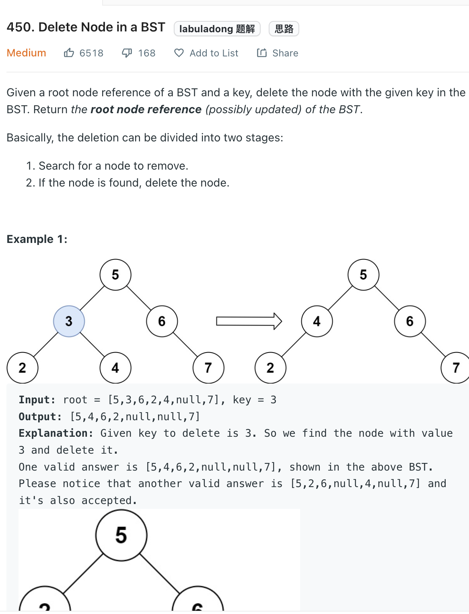

___
[450. Delete Node in a BST](https://leetcode.com/problems/delete-node-in-a-bst/)
___

## 基本思路
* The key point is use the attribute of BST
* If we found the `key`, we repace the with the smallest node of the root.right.
* If the replacement is `None`, just return `None`
* If the replacement has right children, continue the process until the node become a leaf node

___

`Time complexity : O(h)`

`Space complexity : O(1)`
```python
    def deleteNode(self, root: Optional[TreeNode], key: int) -> Optional[TreeNode]:
        if not root:
            return None
        
        if key < root.val:
            root.left = self.deleteNode(root.left, key)
        elif key > root.val:
            root.right = self.deleteNode(root.right, key)
        else:

            if not root.right and not root.left:
                return None
            if not root.right:
                return root.left
            
            minNode = self.findMin(root.right)
            root.val = minNode.val
            root.right = self.deleteNode(root.right, minNode.val)
            
        return root
    
    def findMin(self, root):
        while root.left:
            root = root.left
        return root
```