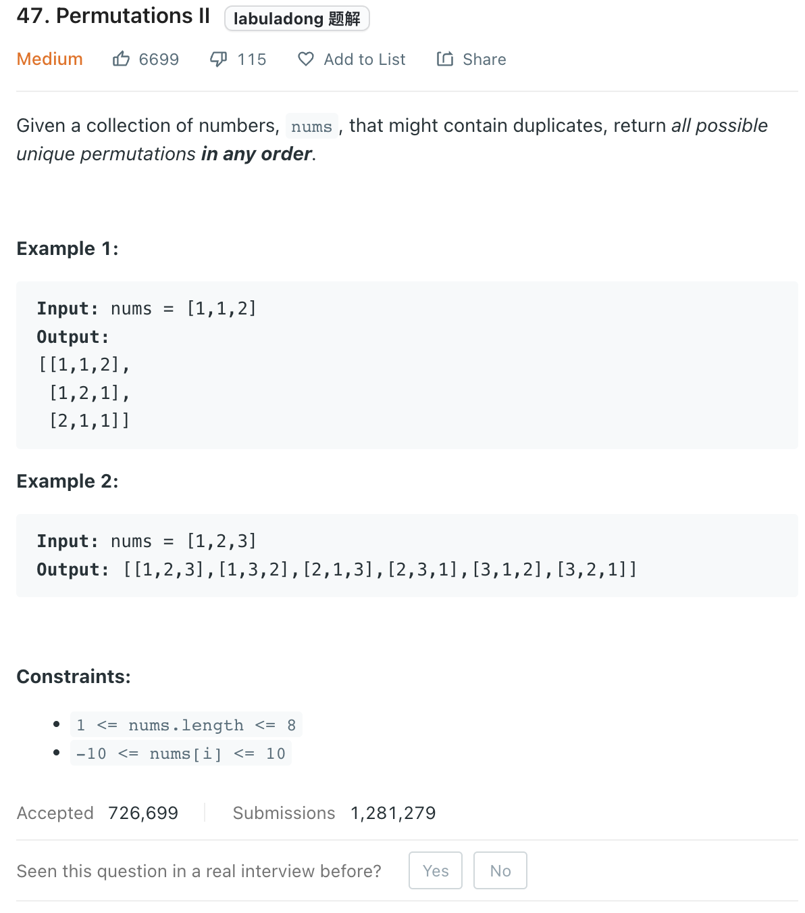

___
[47. Permutations II](https://leetcode.com/problems/permutations-ii/)
___


## 基本思路
* How to manage duplicate?
* Instead of writing some complex logic, we can convert this question into a `HashMap`
* Each number have limit time usage

___

`Time complexity : O(N!)`

`Space complexity : O(N)`
```python
    def permuteUnique(self, nums: List[int]) -> List[List[int]]:
                
        def dfs(current_list):
            if len(current_list) == len(nums):
                answer.append(list(current_list))
                return
            
            for i in dic:
                if dic[i] == 0:
                    continue
                dic[i] -= 1
                current_list.append(i)
                dfs(current_list)
                dic[i] += 1
                current_list.pop()
    
        dic = collections.Counter(nums)
        answer = []
        dfs([])
        return answer
```