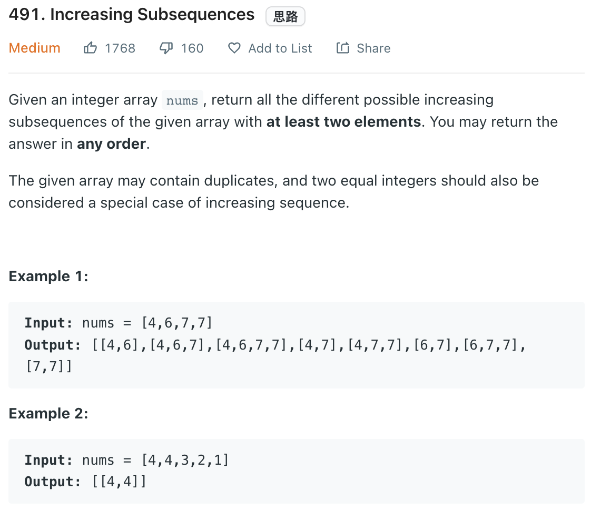

___
[491. Increasing Subsequences](https://leetcode.com/problems/increasing-subsequences/)
___


## 基本思路
* 

___

`Time complexity : O()`

`Space complexity : O()`
```python
class Solution:
    def findSubsequences(self, nums: List[int]) -> List[List[int]]:
        answer = []
        
        def dfs(index, path):
            if len(path) > 1:
                answer.append(list(path))
                
            used = set()
            for i in range(index, len(nums)):
                if nums[i] in used:
                    continue
                
                if len(path) == 0 or path[-1] <= nums[i]:
                    used.add(nums[i])
                    path.append(nums[i])
                    dfs(i + 1, path)
                    path.pop()
            
        dfs(0, [])
        return answer
```