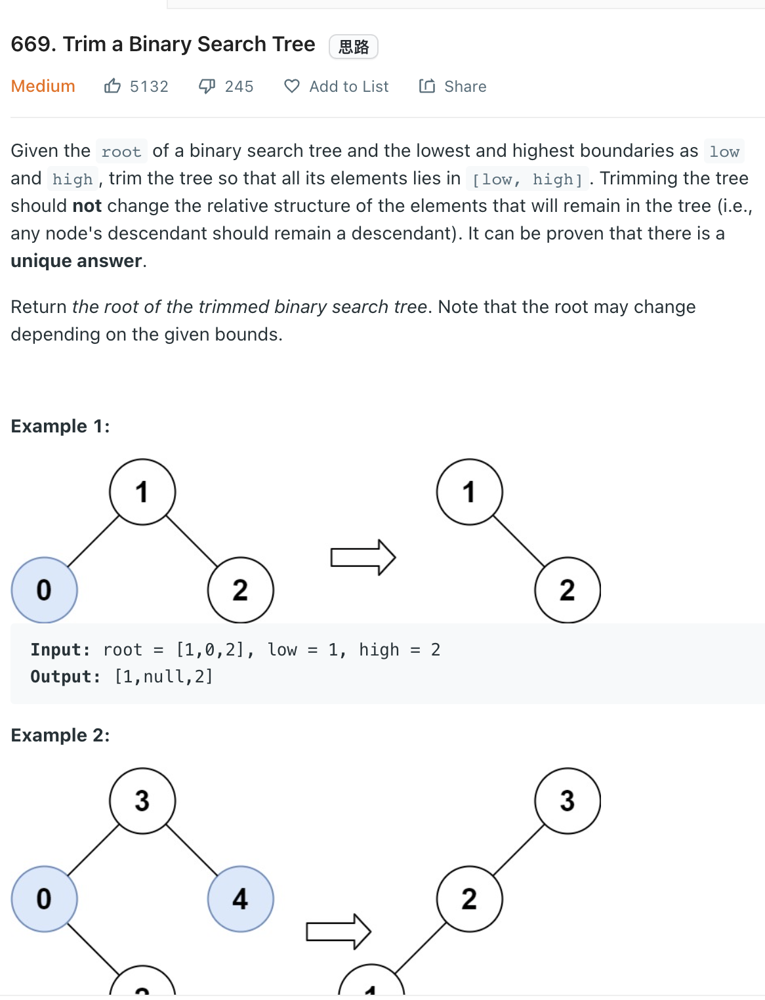

___
[669. Trim a Binary Search Tree](https://leetcode.com/problems/trim-a-binary-search-tree/)
___

## 基本思路
* Think of the attribute of BST
* If `root.val` < `low` which mean all left nodes of `root` is also smaller than `low` 

___

`Time complexity : O(n)`

`Space complexity : O(1)`
```python
    def trimBST(self, root: Optional[TreeNode], low: int, high: int) -> Optional[TreeNode]:
        if not root:
            return None
                 
        if root.val < low:
            return self.trimBST(root.right, low, high)
        if root.val > high:
            return  self.trimBST(root.left, low, high)
        
        root.left = self.trimBST(root.left, low, high)
        root.right = self.trimBST(root.right, low, high)
        
        return root
```