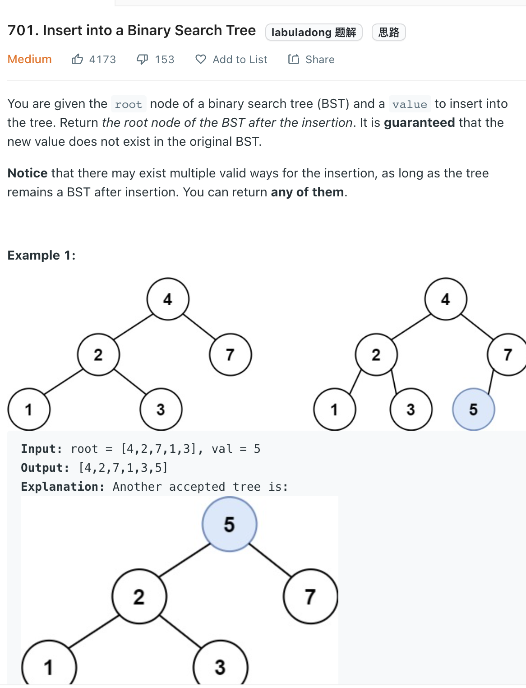

___
[701. Insert into a Binary Search Tree](https://leetcode.com/problems/insert-into-a-binary-search-tree/)
___

## 基本思路
* The key point is A new key is always inserted at the leaf.

___

`Time complexity : O(h)`

`Space complexity : O(1)`
```python
    def insertIntoBST(self, root: Optional[TreeNode], val: int) -> Optional[TreeNode]:
        if not root:
            return TreeNode(val)
        if val > root.val:
            root.right = self.insertIntoBST(root.right, val)
        else:
            root.left = self.insertIntoBST(root.left, val)
        return root
```