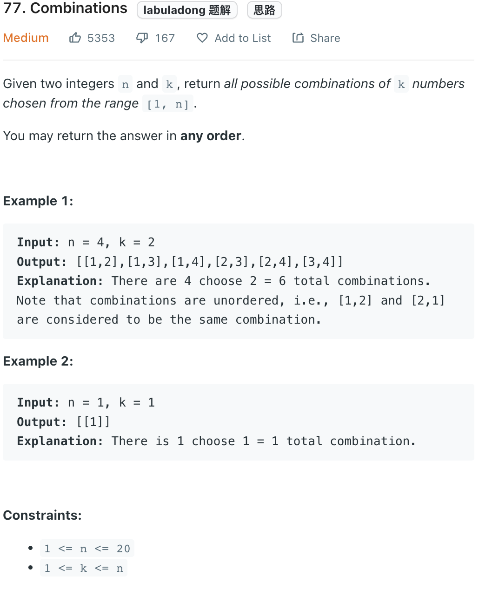

___
[77. Combinations](https://leetcode.com/problems/combinations/)
___


## 基本思路
* 

___

`Time complexity : O()`

`Space complexity : O()`
```python
class Solution:
    def combine(self, n: int, k: int) -> List[List[int]]:
        
        answer = []
        
        def dfs(currentList, index):
            if len(currentList) == k:
                answer.append(list(currentList))
                
            for i in range(index, n + 1):
                currentList.append(i)
                dfs(currentList, i + 1)
                currentList.pop()
                
        dfs([], 1)
        return answer
```