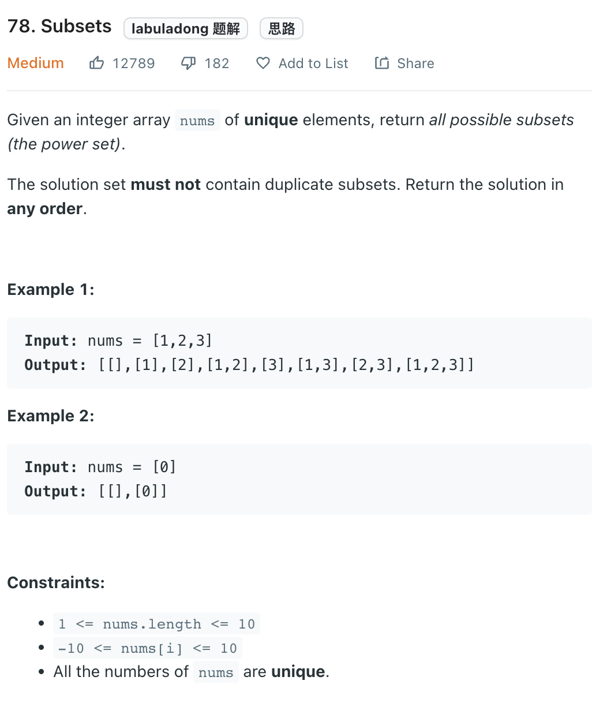

___
[78. Subsets](https://leetcode.com/problems/subsets/)
___

## 分析问题
* 

## 基本思路
* 

___

`Time complexity : O()`

`Space complexity : O()`
```python
class Solution:
    def subsets(self, nums: List[int]) -> List[List[int]]:
        answer = []
        
        def dfs(currentList, index):
            answer.append(list(currentList))
            
            for i in range(index, len(nums)):
                currentList.append(nums[i])
                dfs(currentList, i + 1)
                currentList.pop()
                
        dfs([], 0)
        return answer
```