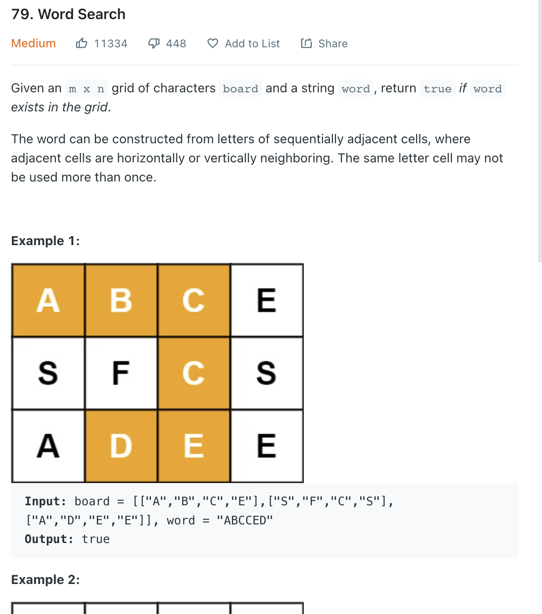

___
[79. Word Search](https://leetcode.com/problems/word-search/)
___

## 基本思路
* 经典题，， 可以用BFS， 也可以用DFS
* 用DFS的话会简单一点

___

`Time complexity : O(? M * N * 4^L)`

`Space complexity : O(1)`
```python
class Solution:
    def exist(self, board: List[List[str]], word: str) -> bool:
        
        self.directions = [(1, 0), (-1, 0), (0, -1), (0, 1)]
        row_length = len(board)
        col_length = len(board[0])
        
        for i in range(row_length):
            for j in range(col_length):
                if board[i][j] == word[0]:
                    if self.dfs(board, word, i, j, 0):
                        return True
                    
        return False
    
    def dfs(self, board, word, row, col, index):
        
        if index == len(word):
            return True
        
        if row < 0 or row >= len(board) or col < 0 or col >= len(board[0]):
            return False
        
        if board[row][col] != word[index]:
            return False
        
        temp = board[row][col]
        board[row][col] = '*'
        
        for (x, y) in self.directions:
            if self.dfs(board, word, row + x, col + y, index + 1):
                return True
            
        board[row][col] = temp
        return False
```