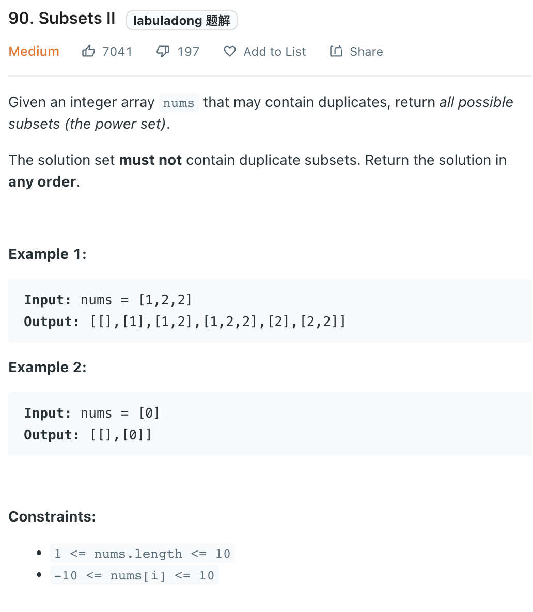

___
[90. Subsets II](https://leetcode.com/problems/subsets-ii/)
___


___

`Time complexity : O()`

`Space complexity : O()`
```python
class Solution:
    def subsetsWithDup(self, nums: List[int]) -> List[List[int]]:
        nums.sort()
        answer = []
        
        def dfs(currentList, index):
            answer.append(list(currentList))
            
            for i in range(index, len(nums)):
                if i != index and nums[i] == nums[i - 1]:
                    continue
                currentList.append(nums[i])
                dfs(currentList, i + 1)
                currentList.pop()
                
        dfs([], 0)
        return answer
```