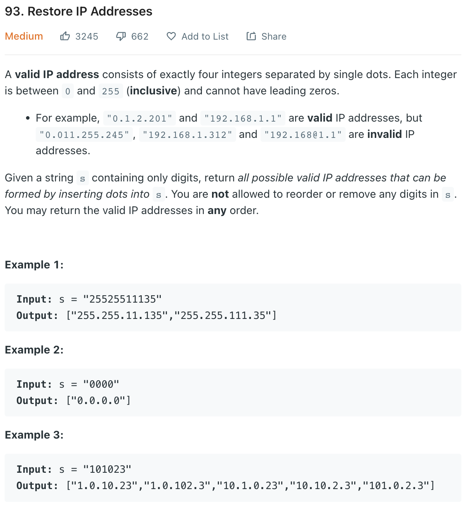

___
[93. Restore IP Addresses](https://leetcode.com/problems/restore-ip-addresses/)
___

## 分析问题
* 

## 基本思路
* 

___

`Time complexity : O()`

`Space complexity : O()`
```python
class Solution:
    def restoreIpAddresses(self, s: str) -> List[str]:
        answer = []
        path = []
        
        def dfs(startIndex, numOfDots):
            
            if startIndex >= len(s) and numOfDots == -1:
                answer.append('.'.join(path))
                
            if numOfDots < 0:
                return
            
            for i in range(startIndex, len(s)):
                numStr = s[startIndex: i + 1]
                if len(numStr) >= 2 and numStr[0] == '0':
                    break
                    
                if 0 <= int(numStr) <= 255:
                    path.append(numStr)
                    dfs(i + 1, numOfDots - 1)
                    path.pop()
        if len(s) > 12:
            return []
        dfs(0, 3)    
        return answer
```