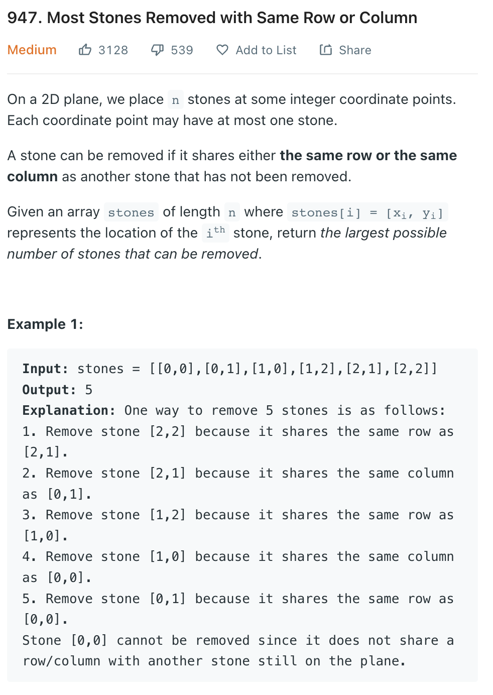
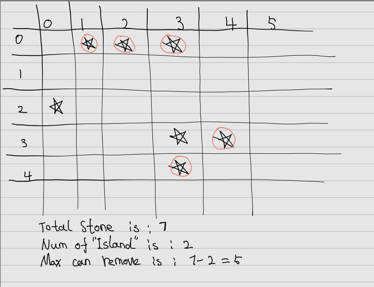

___
[947. Most Stones Removed with Same Row or Column](https://leetcode.com/problems/most-stones-removed-with-same-row-or-column/)
___

## 分析问题
* Once you know this question, you will find that's really easy.
* The question is how you find the pattern?

## 基本思路
* Connected stones can be reduced to 1 stone, the maximum stones can be removed = stones number - islands number. so just count the number of "islands".
* But how to find the island?
* If we have 2 maps `rowMap` and `colMap`
* `rowMap[0] = [(0,1), (0,3)]` means there exists two stones at row 0.
* Same meanning with `colMap`
* For real `numOfIsland` question, the rule is if one of four directions is 1, we expand.
* In this question:
* We loop over all the stones.
* We mark all stones with same row, and col as visited



___

`Time complexity : O(n^2)`

`Space complexity : O(n^2)`
```python
class Solution:
    def removeStones(self, stones: List[List[int]]) -> int:
        rowMap = defaultdict(list)
        colMap = defaultdict(list)
        
        for row, col in stones:
            rowMap[row].append((row, col))
            colMap[col].append((row, col))
        
        totalStones = len(stones)
        islands = 0
        visited = set()
        
        for i, j in stones:
            if (i, j) not in visited:
                islands += 1
                queue = collections.deque()
                queue.append((i, j))
                visited.add((i, j))
                while queue:
                    row, col = queue.popleft()
                    
                    for newRow, newCol in rowMap[row]:
                        if (newRow, newCol) not in visited:
                            queue.append((newRow, newCol))
                            visited.add((newRow, newCol))
                    
                    for newRow, newCol in colMap[col]:
                        if (newRow, newCol) not in visited:
                            queue.append((newRow, newCol))
                            visited.add((newRow, newCol))
                            
        return totalStones - islands
                
```