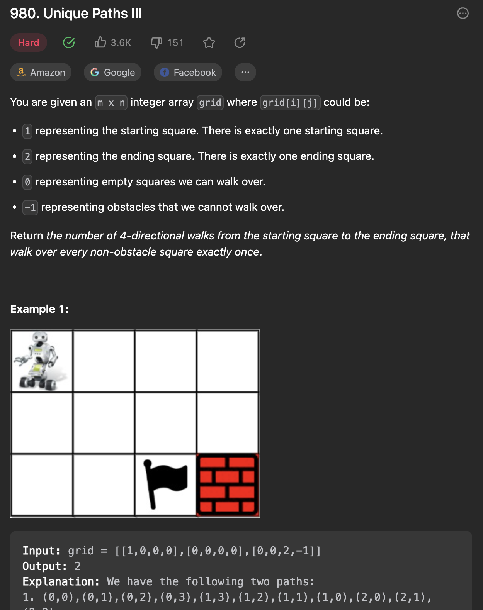

___
[980. Unique Paths III](https://leetcode.com/problems/unique-paths-iii/description/)
___


## 基本思路
* Normal DFS

___

`Time complexity : O()`

`Space complexity : O()`
```python
class Solution:
    def uniquePathsIII(self, grid: List[List[int]]) -> int:
        numOfEmpty, startRow, startCol = 1, 0, 0
        rowLength, colLength = len(grid), len(grid[0])
        for i in range(rowLength):
            for j in range(colLength):
                if grid[i][j] == 1:
                    startRow, startCol = i, j
                if grid[i][j] == 0:
                    numOfEmpty += 1
        
        def dfs(row, col):
            nonlocal answer, numOfEmpty
            if grid[row][col] == 2:
                if numOfEmpty == 0:
                    answer += 1
                return
            
            grid[row][col] = -1
            numOfEmpty -= 1
            for x, y in [(row + 1, col), (row - 1, col), (row, col + 1), (row, col - 1)]:
                if 0 <= x < rowLength and 0 <= y < colLength:
                    if grid[x][y] == -1:
                        continue
                    dfs(x, y)
            grid[row][col] = 0
            numOfEmpty += 1
        
        answer = 0
        dfs(startRow, startCol)
        return answer
```