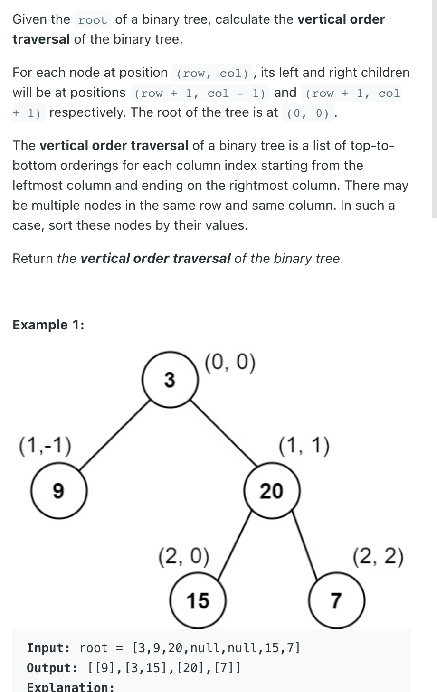

___
[987. Vertical Order Traversal of a Binary Tree](https://leetcode.com/problems/vertical-order-traversal-of-a-binary-tree/)
___

## 基本思路
* This question is same as 
* [314. Binary Tree Vertical Order Traversal](https://github.com/longlonglu/shuati/blob/main/hash_map/314.%20Binary%20Tree%20Vertical%20Order%20Traversal/314.%20Binary%20Tree%20Vertical%20Order%20Traversal.md)
* But with addition condition.
* If two element at same row, sort by there values

___

`Time complexity : O(n + sort each col level)`

`Space complexity : O(n)`
```python
class Solution:
    def verticalTraversal(self, root: Optional[TreeNode]) -> List[List[int]]:
        if not root:
            return []
        dic = defaultdict(list)
        minCol = maxCol = 0
        def dfs(root, col, row):
            nonlocal minCol, maxCol
            if not root:
                return
            minCol = min(minCol, col)
            maxCol = max(maxCol, col)
            dic[col].append((row, root.val))
            dfs(root.left, col - 1, row + 1)
            dfs(root.right, col + 1, row + 1)
        dfs(root, 0, 0)
        answer = []
        for i in range(minCol, maxCol + 1):
            dic[i].sort(key=lambda x:(x[0], x[1])) # sort by row, If there exists same row, sort by value
            answer.append(value for _, value in dic[i])
        return answer
```