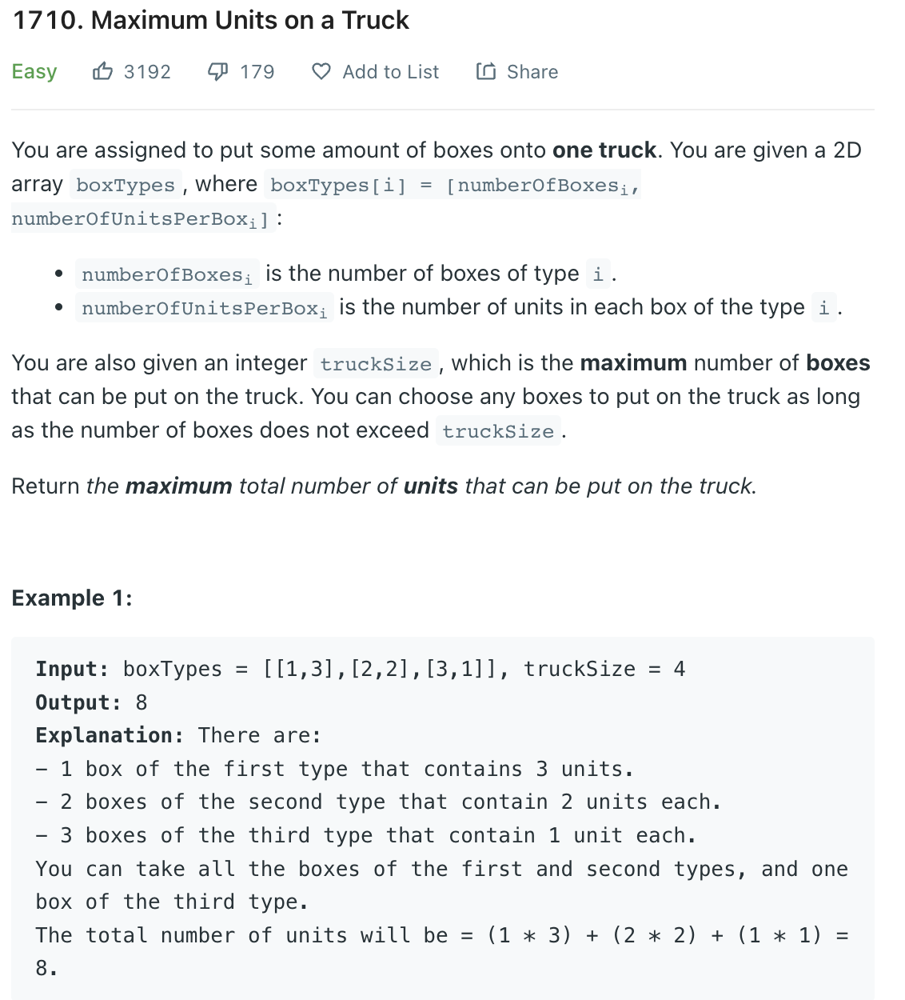

___
[1710. Maximum Units on a Truck](1710. Maximum Units on a Truck)
___


## 基本思路
* This is a greedy problem

___

`Time complexity : O(nlogn)`

`Space complexity : O(1)`
```python
class Solution:
    def maximumUnits(self, boxTypes: List[List[int]], truckSize: int) -> int:
        boxTypes.sort(key= lambda x: -x[1])
        
        answer = 0
        for (boxes, units) in boxTypes[0:]:
            
            if truckSize - boxes >= 0:
                truckSize -= boxes
                answer += boxes * units
            else:
                while truckSize > 0:
                    truckSize -= 1
                    answer += units
                return answer
        
        return answer
```