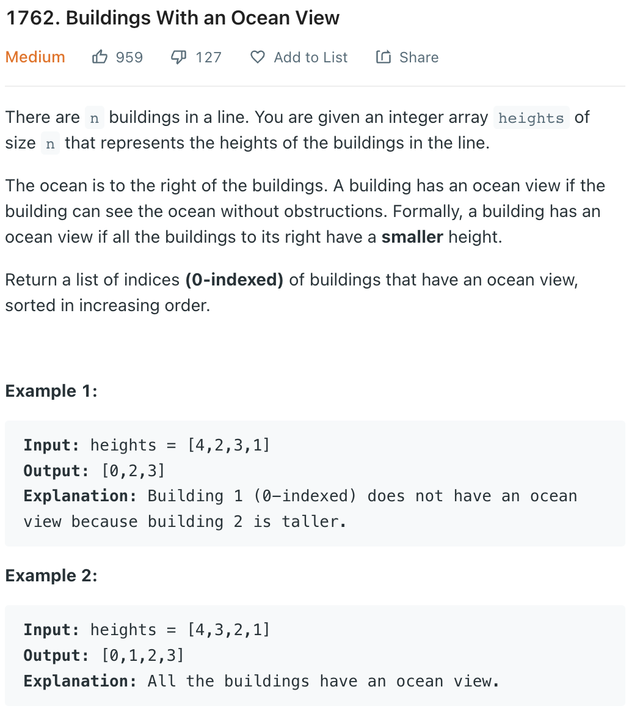

___
[1762. Buildings With an Ocean View](https://leetcode.com/problems/buildings-with-an-ocean-view/)
___

## 基本思路
* emmmm, greedy

___

`Time complexity : O(n)`

`Space complexity : O(1 or n)`
```python
class Solution:
    def findBuildings(self, heights: List[int]) -> List[int]:
        length = len(heights)
        currentMax = heights[length - 1]
        answer = [length - 1]
        for i in range(length - 2, -1, -1):
            if heights[i] > currentMax:
                answer.append(i)
                currentMax = heights[i]
        answer.reverse()
        return answer
        
        
```