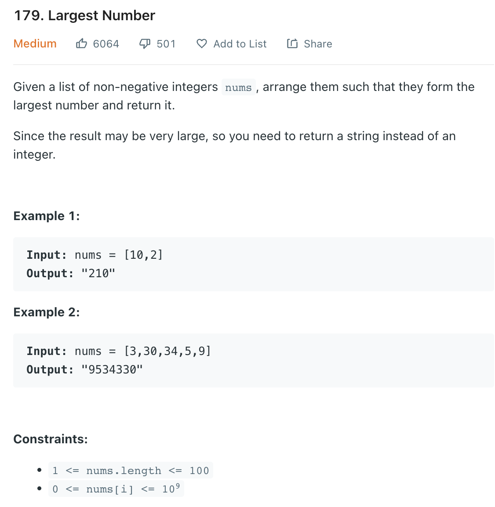

___
[179. Largest Number](https://leetcode.com/problems/largest-number/)
___


## 基本思路
* This is a greedy sorting problem.


___

`Time complexity : O(nlog(n))`

`Space complexity : O(n)`
```java
class Solution {
    public String largestNumber(int[] nums) {
        
        String[] strNums = new String[nums.length];
        
        for (int i = 0; i < nums.length; i++) {
            strNums[i] = nums[i] + "";
        }

        
        Arrays.sort(strNums, new Comparator<String>() {
            @Override
            public int compare(String a, String b) {
                String a1 = a + b;
                String b1 = b + a;
                return -a1.compareTo(b1);
            }
        });
        
        if (strNums[0].equals("0")) {
            return "0";
        }
        
        String answer = "";
        for (String s: strNums) {
            answer += s;
        }
        
        return answer;
    }
}
```