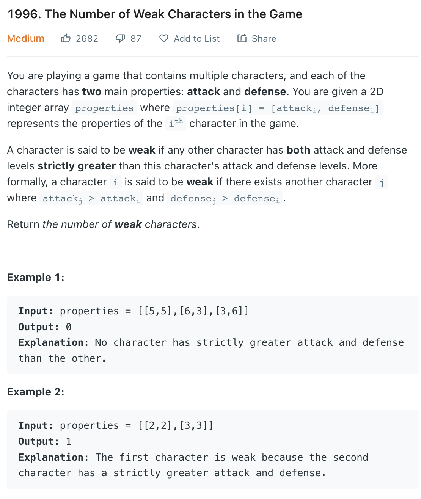

___
[1996. The Number of Weak Characters in the Game](https://leetcode.com/problems/the-number-of-weak-characters-in-the-game/)
___

## 基本思路
* Note [[2,2], [3,3], [4,4]] answer = 2
* This is a tricky question, because we have 2 things to sort.
* If we sort the attack by increasing and defense by decreasing.
* The largest attack will be at the right most.
* If 2 attacks are the same, we sort the defense by decreasing.
* [[1,5][10,4],[10,3]] after sort [[1,5],[10,4],[10,3]]
* In this way, we only need to compare the maxDefense.
* From right to left, we know the attack will always math, but the defense may not.
* So now the question become a 1d compare question.

___

`Time complexity : O(nlog(n))`

`Space complexity : O(1)`
```python
class Solution:
    def numberOfWeakCharacters(self, properties: List[List[int]]) -> int:
        properties = sorted(properties, key=lambda x:(x[0], -x[1]))
        maxDefense = 0
        answer = 0
        
        for i in range(len(properties) - 1, -1, -1):
            attack, defense = properties[i]
            if defense < maxDefense:
                answer += 1
            maxDefense = max(defense, maxDefense)
            
        return answer
```