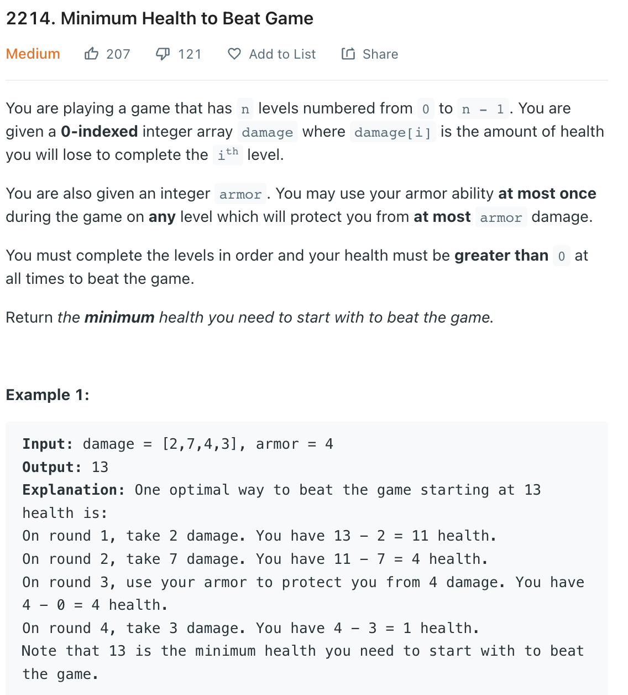

___
[2214. Minimum Health to Beat Game](https://leetcode.com/problems/minimum-health-to-beat-game/)
___

## 基本思路
* 干就完了

___

`Time complexity : O(n)`

`Space complexity : O(1)`
```python
class Solution:
    def minimumHealth(self, damage: List[int], armor: int) -> int:
        
        totalDamages = sum(damage)
        maxDamages = max(damage)
        
        
        return totalDamages - min(maxDamages, armor) + 1
```