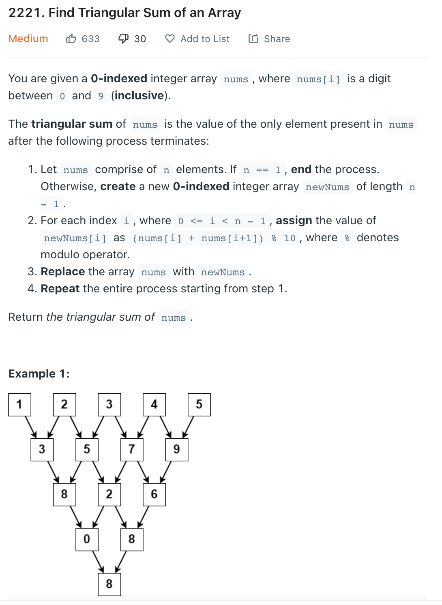

___
[2221. Find Triangular Sum of an Array](https://leetcode.com/problems/find-triangular-sum-of-an-array/)
___


## 基本思路
* This is the easiest question i have done

___

`Time complexity : O(n^2)`

`Space complexity : O(1)`
```python
class Solution:
    def triangularSum(self, nums: List[int]) -> int:
        level = len(nums) - 1
        
        while level != 0:
            for i in range(level):
                nums[i] = (nums[i] + nums[i + 1]) % 10
            level -= 1
        
        return nums[0]
            
        
```