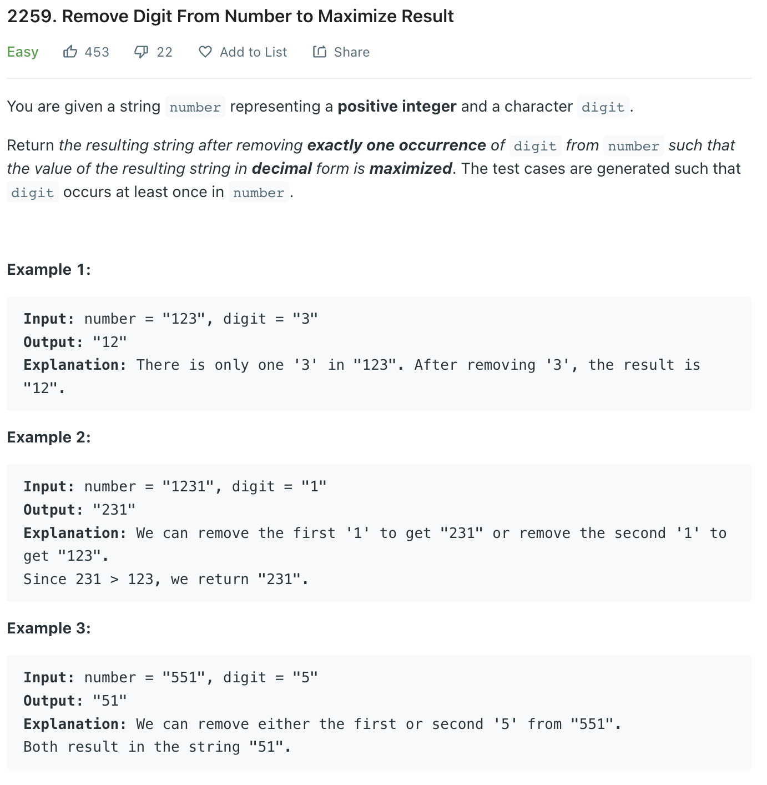

___
[2259. Remove Digit From Number to Maximize Result](https://leetcode.com/problems/remove-digit-from-number-to-maximize-result/)
___


## 基本思路
* If you see that digit, remove it and check the value 

___

`Time complexity : O(n)`

`Space complexity : O(1)`
```python
class Solution:
    def removeDigit(self, number: str, digit: str) -> str:
        ans = 0
        for i, dig in enumerate(list(number)):
            if dig == digit:
                ans = max(ans, int(number[:i]+number[i+1:]))
        
        return str(ans)
```