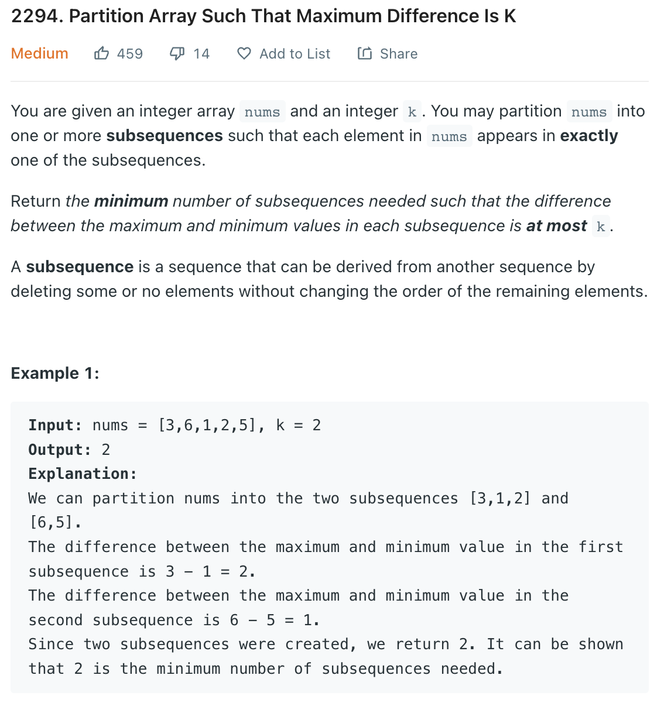

___
[2294. Partition Array Such That Maximum Difference Is K](https://leetcode.com/problems/partition-array-such-that-maximum-difference-is-k/)
___

## 基本思路
* Usually for this question, think sort, two pointer,
* If we sort the array first, then the question will beceome for any window, if the `nums[right]` - `nums[left]` <= `k`, we can continue expand the window
* Else back to current index and start next window.

___

`Time complexity : O(nlogn)`

`Space complexity : O(1)`
```java
class Solution {
    public int partitionArray(int[] nums, int k) {
        Arrays.sort(nums);
        
        int answer = 0;
        for (int i = 0; i < nums.length; i++) {
            int currentMin = nums[i];
            answer++;
            while (i < nums.length) {
                if (nums[i] - currentMin <= k) {
                    i++;
                } else {
                    i--;
                    break;
                }
            }
        }
        return answer;
    }
}
```