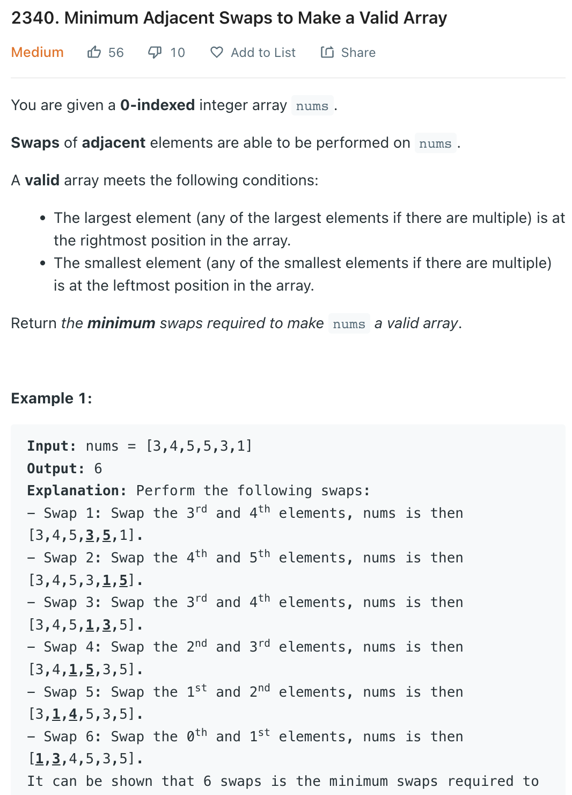

___
[2340. Minimum Adjacent Swaps to Make a Valid Array](https://leetcode.com/problems/minimum-adjacent-swaps-to-make-a-valid-array/)
___

## 基本思路
* This is a greedy question.
* Find out the `leftMostSmallest(value, index)` and `rightMostSmallest(value, index)`
* If `leftIndex` > `rightIndex`. Means while we do the swap, there will be 1 overlap
* Else do the normal swap

___

`Time complexity : O(n)`

`Space complexity : O(1)`
```python
class Solution:
    def minimumSwaps(self, nums: List[int]) -> int:
        length = len(nums)
        if length == 0 or length == 1:
            return 0
        
        leftMostSmallest = (nums[0], 0)
        rightMostLargest = (nums[0], 0)
        
        for i in range(length):
            num = nums[i]
            
            if num < leftMostSmallest[0]:
                leftMostSmallest = (nums[i], i)
            if num >= rightMostLargest[0]:
                rightMostLargest = (nums[i], i)
                
        leftIndex = leftMostSmallest[1]
        rightIndex = rightMostLargest[1]
        
        if leftIndex > rightIndex:
            return (leftIndex - 1) + (length - 1 - rightIndex)
        else:
            return (leftIndex) + (length - 1 - rightIndex)
            
```