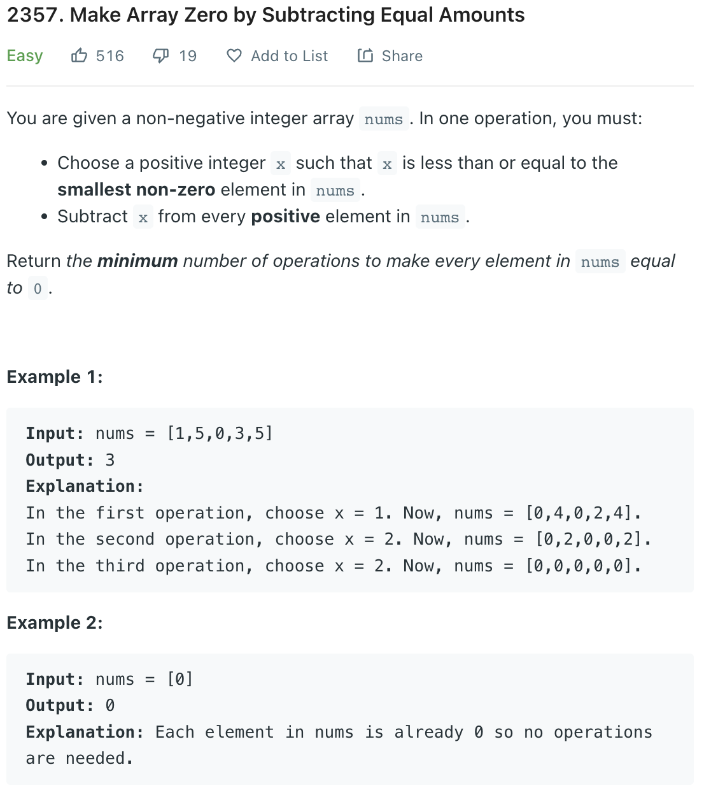

___
[2357. Make Array Zero by Subtracting Equal Amounts](https://leetcode.com/problems/make-array-zero-by-subtracting-equal-amounts/)
___

## 基本思路
* The normal way of solving this question is sort first, then substract the minimum number in `nums`

___

`Time complexity : O(n^2)`

`Space complexity : O(1)`
```python
class Solution:
    def minimumOperations(self, nums: List[int]) -> int:
        nums.sort()
        index = 0
        answer = 0
        while index < len(nums):
            while index < len(nums) and nums[index] == 0:
                index += 1
            if index == len(nums):
                continue
            current_min = nums[index]
            for i in range(index, len(nums)):
                nums[i] -= current_min
            answer += 1
            
        return answer

```

___

```java
class Solution {
    public int minimumOperations(int[] nums) {
        HashSet<Integer> set = new HashSet<>();
        for (int i: nums) {
            if (i > 0) {
                set.add(i);
            }
        }
        return set.size();
    }
}
```