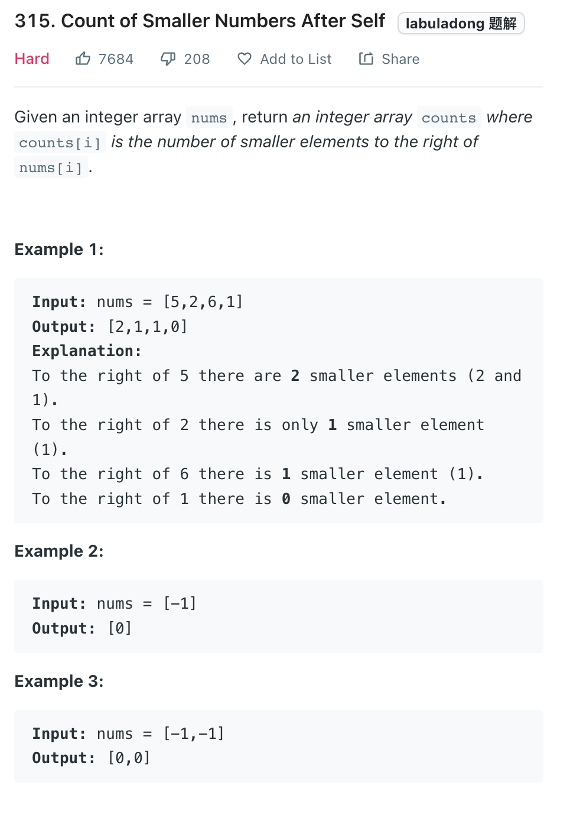
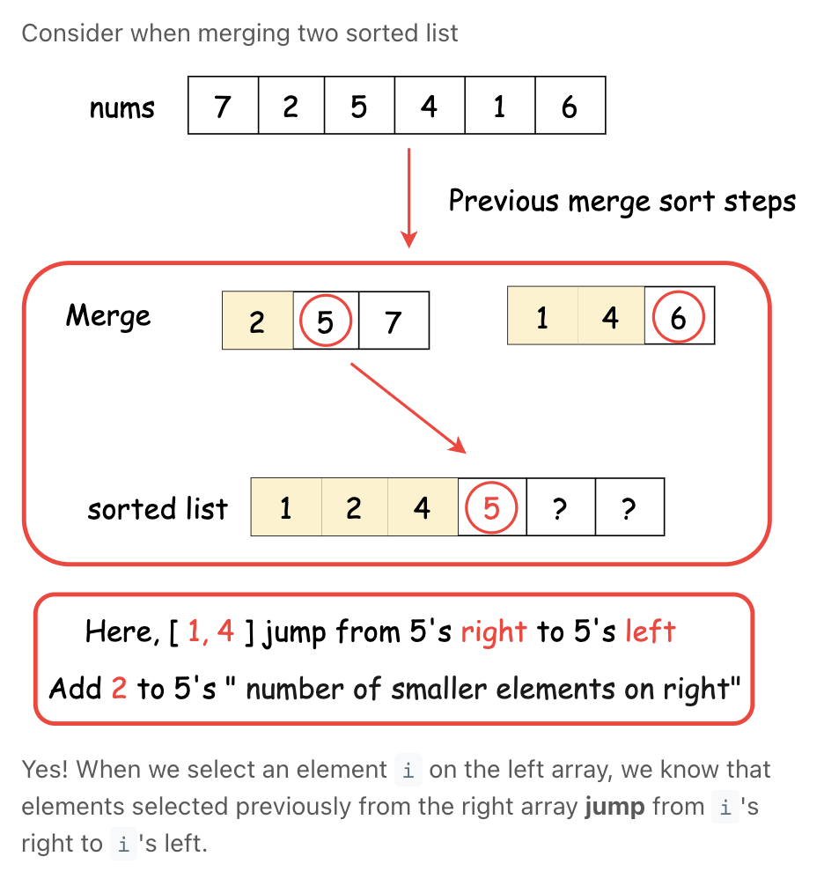

___
[315. Count of Smaller Numbers After Self](https://leetcode.com/problems/count-of-smaller-numbers-after-self/)
___

## 基本思路
* When we doing the merge sort, the mission is merge two sorted list together.
* While merge two sorted list, we will compare which current element is smaller.
* We will put the smaller element at front(low), then there will be highBound - mid - 1 elements are smaller than current element.
* 

___

`Time complexity : O(nlog(n))`

`Space complexity : O(n)`
```java
class Solution {
    private class Pair {
        int val, id;
        Pair(int val, int id) {
            // 记录数组的元素值
            this.val = val;
            // 记录元素在数组中的原始索引
            this.id = id;
        }
    }
    
    // 归并排序所用的辅助数组
    private Pair[] temp;
    // 记录每个元素后面比自己小的元素个数
    private int[] count;
    
    // 主函数
    public List<Integer> countSmaller(int[] nums) {
        int n = nums.length;
        count = new int[n];
        temp = new Pair[n];
        Pair[] arr = new Pair[n];
        // 记录元素原始的索引位置，以便在 count 数组中更新结果
        for (int i = 0; i < n; i++)
            arr[i] = new Pair(nums[i], i);
        
        // 执行归并排序，本题结果被记录在 count 数组中
        sort(arr, 0, n - 1);
        
        List<Integer> res = new LinkedList<>();
        for (int c : count) res.add(c);
        return res;
    }
    
    // 归并排序
    private void sort(Pair[] arr, int low, int high) {
        if (low == high) return;
        int mid = low + (high - low) / 2;
        sort(arr, low, mid);
        sort(arr, mid + 1, high);
        merge(arr, low, mid, high);
    }
    
    // 合并两个有序数组
    private void merge(Pair[] arr, int lowBound, int mid, int highBound) {
        for (int i = lowBound; i <= highBound; i++) {
            temp[i] = arr[i];
        }
        
        int low = lowBound, high = mid + 1;
        for (int i = lowBound; i <= highBound; i++) {
            if (low == mid + 1) {
                arr[i] = temp[high++];
            } else if (high == highBound + 1) {
                arr[i] = temp[low++];
                count[arr[i].id] += high - mid - 1;
            } else if (temp[low].val > temp[high].val) {
                arr[i] = temp[high++];
            } else {
                arr[i] = temp[low++];
                count[arr[i].id] += high - mid - 1;
            }
        }
    }
}

```