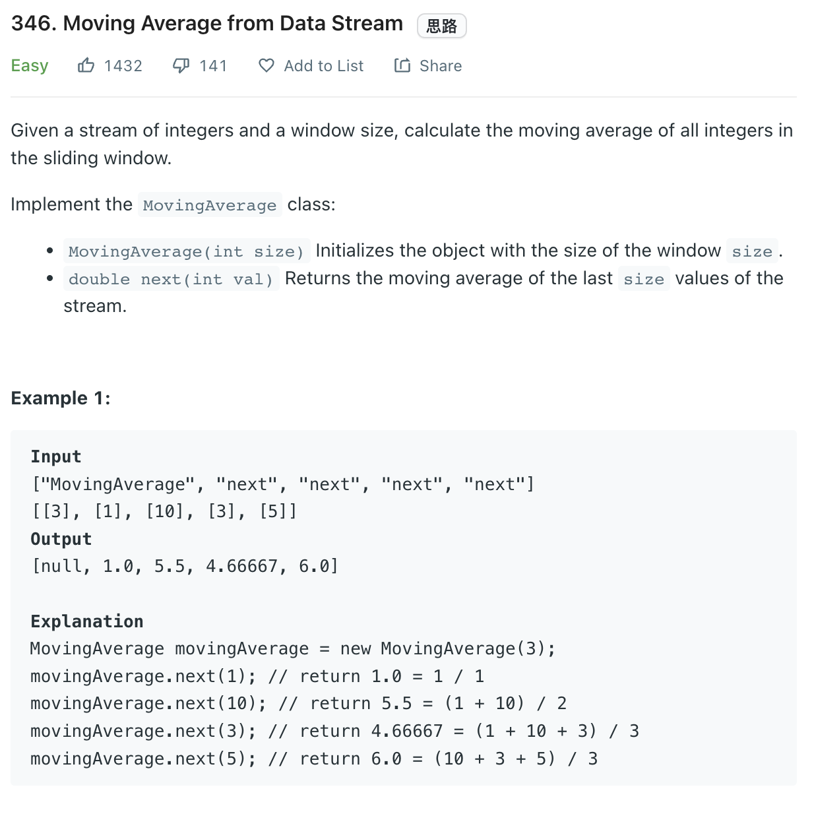

___
[346. Moving Average from Data Stream](https://leetcode.com/problems/moving-average-from-data-stream/)
___


## 基本思路
* Use `queue` and `prefix_Sum`

___

`Time complexity : O(1)`

`Space complexity : O(size)`
```python
class MovingAverage:

    def __init__(self, size: int):
        self.size = size
        self.queue = collections.deque()
        self.totalSum = 0

    def next(self, val: int) -> float:
        self.totalSum += val
        self.queue.append(val)
        if len(self.queue) <= self.size:       
            return self.totalSum / len(self.queue)
        else:
            self.totalSum -= self.queue.popleft()
            return self.totalSum / len(self.queue)


# Your MovingAverage object will be instantiated and called as such:
# obj = MovingAverage(size)
# param_1 = obj.next(val)
```