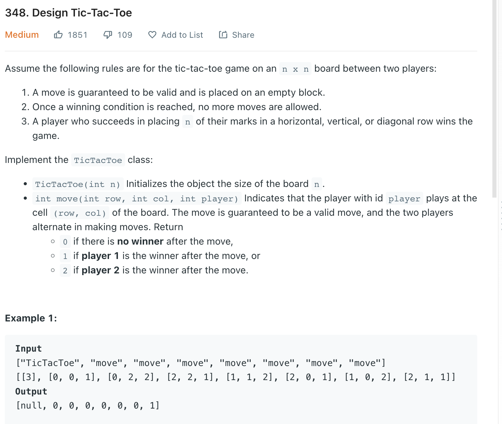

___
[348. Design Tic-Tac-Toe](https://leetcode.com/problems/design-tic-tac-toe/)
___


## 基本思路
* I think you already memorized

___

`Time complexity : O(1)`

`Space complexity : O(n)`
```python
class TicTacToe:

    def __init__(self, n: int):
        self.n = n
        self.row = defaultdict(int)
        self.col = defaultdict(int)
        self.diagonal = 0
        self.antiDiagonal = 0
        

    def move(self, row: int, col: int, player: int) -> int:
        score = 1 if player == 1 else -1
        
        self.row[row] += score
        self.col[col] += score
        if row == col:
            self.diagonal += score
        if row + col == self.n - 1:   
            self.antiDiagonal += score
        
        if self.n in [abs(self.row[row]), abs(self.col[col]), abs(self.diagonal), abs(self.antiDiagonal)]:
            return player
        return 0


# Your TicTacToe object will be instantiated and called as such:
# obj = TicTacToe(n)
# param_1 = obj.move(row,col,player)
```