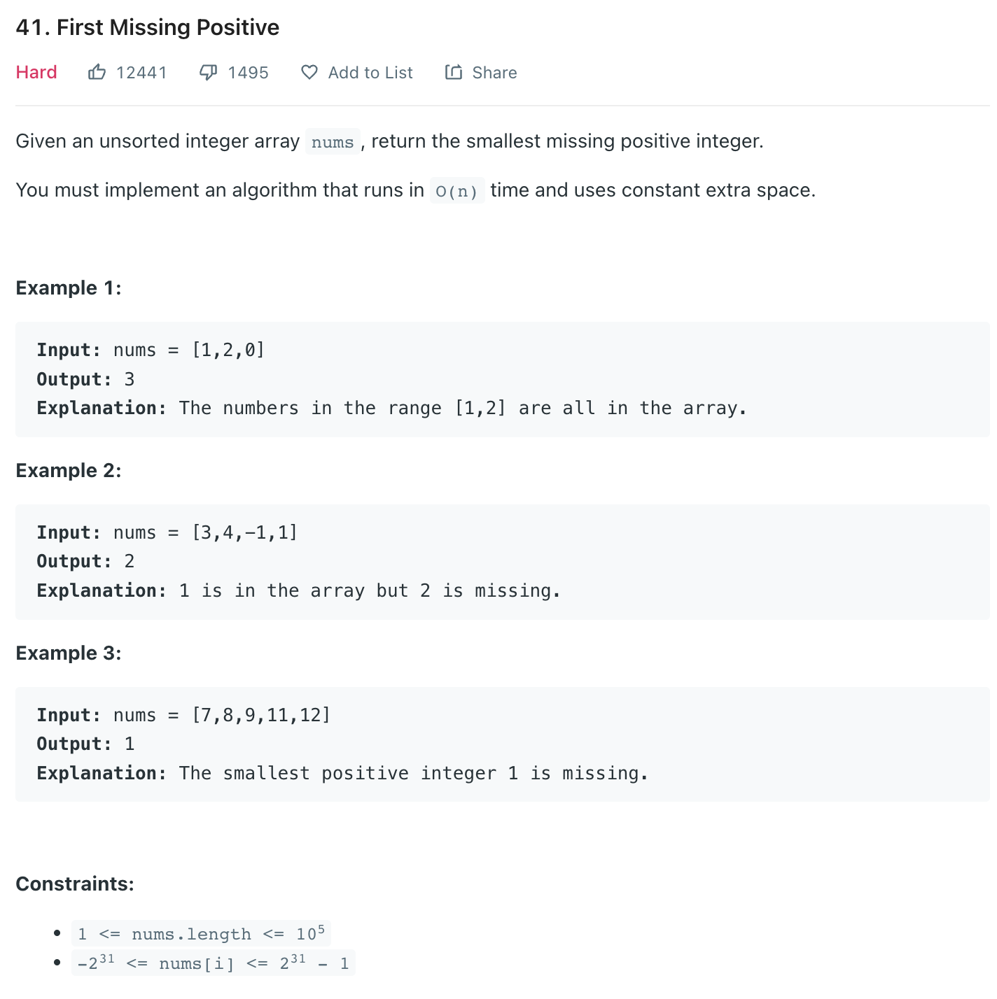
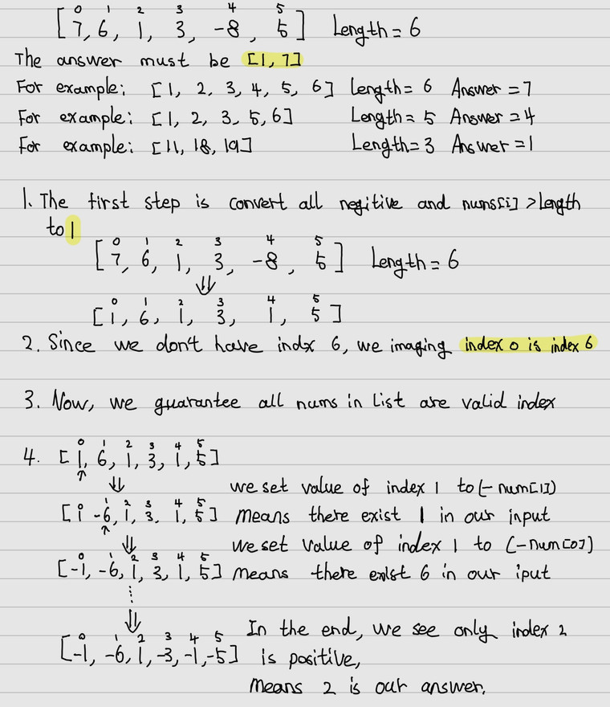

___
[41. First Missing Positive](https://leetcode.com/problems/first-missing-positive/)
___


## 基本思路
* The easy way is using O(n) space complexity
* We store all num into a `set`.
* Then start `missingNum` from 1 and ++ until set not contains `missingNum`
* 

___

`Time complexity : O(n)`

`Space complexity : O(1)`
```python
class Solution:
    def firstMissingPositive(self, nums: List[int]) -> int:
        missingNum = 1
        integers = set([num for num in nums if num > 0])
                
        while missingNum in integers:
            missingNum += 1
            
        return missingNum
```

___


```python
class Solution:
    def firstMissingPositive(self, nums: List[int]) -> int:
        length = len(nums)
        if 1 not in nums:
            return 1
        for i in range(length):
            if nums[i] <= 0 or nums[i] > length:
                nums[i] = 1
                
        for i in range(length):
            num = abs(nums[i])
            
            if num == length:
                nums[0] = - abs(nums[0])
            else:
                nums[num] = - abs(nums[num])
        
        for i in range(1, length):
            if nums[i] > 0:
                return i
        
        if nums[0] > 0:
            return length
        
        return length + 1
```