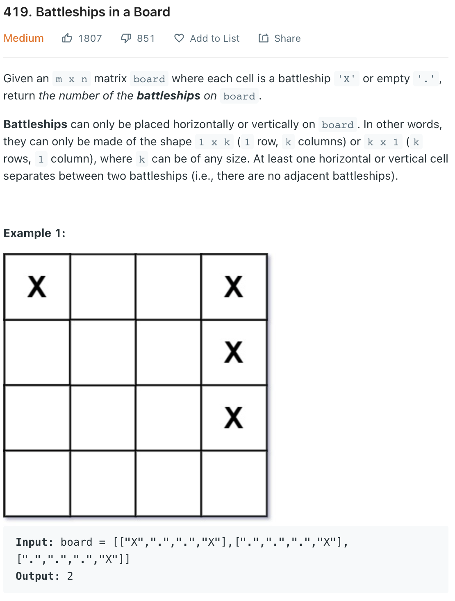

___
[419. Battleships in a Board](https://leetcode.com/problems/battleships-in-a-board/)
___

## 基本思路
* We can use normal DFS or BFS to solve this question.
* But there is a better way.
* Since each battleship is either vertical or horizontal.
* Mean if board[i][j] is the battleship, then board[i - 1][j] or board[i][j - 1] count as the same battleship
* Within that in mind, our solution can be really easy.
* If a battleship's left and top are not battleship, then this battleship is a new battleship

___

`Time complexity : O(N*M)`

`Space complexity : O(1)`
```python
class Solution:
    def countBattleships(self, board: List[List[str]]) -> int:
        answer = 0
        
        for i in range(len(board)):
            for j in range(len(board[0])):
                if board[i][j] == '.':
                    continue
                if i > 0 and board[i - 1][j] == 'X':
                    continue
                if j > 0 and board[i][j - 1] == 'X':
                    continue
                answer += 1
            
        return answer
```